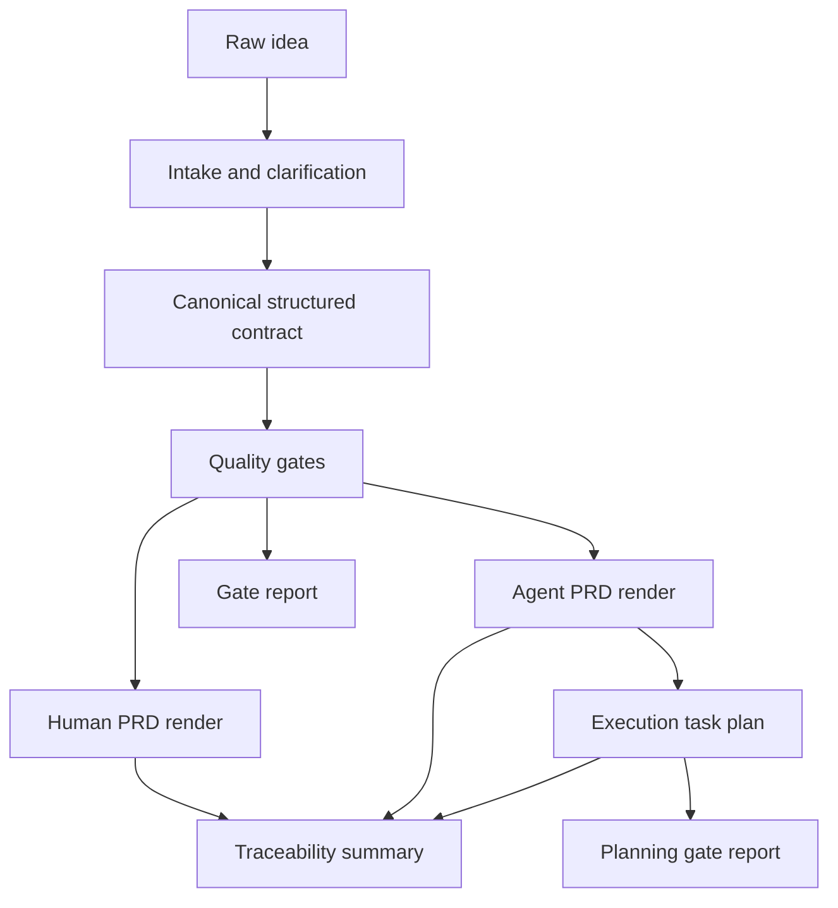

# PRD Intake 技能设计说明

## 修订记录

| 版本 | 日期 | 修订人 | 修订内容 | 依据 |
| --- | --- | --- | --- | --- |
| v1.0 | 2026-05-25 | Codex | 将 README 收束为技能目标、工作流、文档地图和设计原则；移除与输出契约重复的字段规则。 | 用户确认：以 output contract 为核心推导渲染逻辑 |
| v1.1 | 2026-05-25 | Codex | 明确 Human PRD 优先是默认工作流而非派生关系，并同步 object payload、状态与审计层口径。 | 设计审计修复 |
| v1.2 | 2026-05-25 | Codex | 收窄 sibling consistency 语义，并登记 contract envelope 样例作为结构化输出 fixture。 | 收敛审计修复 |
| v1.3 | 2026-05-25 | Codex | 将核心文档口径更新为五份，纳入 `idea-to-output-contract.md`。 | 收敛审计修复 |
| v1.4 | 2026-05-26 | Codex | 明确 `contract-envelope-example` 是最小 smoke fixture，并规定完整 fixture 才需要覆盖 PRD examples 的全部 canonical ID。 | 收敛审计修复 |
| v1.5 | 2026-05-26 | Codex | 纳入 `prd-to-execution-tasks.md`，定义从 execution-ready Agent PRD 派生执行任务图的规则。 | PRD 执行任务拆解设计 |
| v1.6 | 2026-05-26 | Codex | 明确 `prd-to-execution-tasks.md` 同时包含任务拆解设计流程、过程产物、评审循环和好实例校准。 | 任务拆解设计文档收敛 |
| v1.7 | 2026-05-26 | Codex | 明确执行任务计划包含 ready/blocked 输出契约、source metadata、parallel groups、validator 最低实现和 blocked fixtures。 | 收敛 review 修复 |

## 1. 文档定位

本文说明 `prd-intake` 技能要解决什么问题、如何工作、六份核心文档如何分工。字段、对象、渲染块、门禁、最终输出结构的权威定义只在 `output-contract.md` 中维护。

`prd-intake` 面向有产品想法但尚未形成完整需求文档的使用者。它把模糊想法转成一份 canonical structured contract，再从这份 contract 渲染出 Human PRD 和 Agent PRD。

技能不做模板填空。它必须先澄清事实、范围、假设、开放问题和验收标准，再决定能否生成可评审或可执行的 PRD。

## 2. 核心目标

| 目标 | 说明 | 成功标准 |
| --- | --- | --- |
| 补全产品思考 | 从原始想法中识别用户、问题、目标、范围、指标、风险和约束。 | 不把未知项写成事实。 |
| 形成唯一事实模型 | 维护一份包含完整对象 payload 的 canonical structured contract。 | Human PRD 与 Agent PRD 都只能从该 contract 渲染。 |
| 支持人类决策 | 生成专业简体中文 Human PRD。 | 人类能快速判断“要做什么、标准是什么、如何实现”。 |
| 支持 Agent 执行 | 生成英文 Agent PRD。 | Agent 能知道做什么、不做什么、如何验证、何时停止。 |
| 支持执行拆解 | 从 execution-ready Agent PRD 派生任务图。 | 每个任务都有 contract refs、verification/done/stop refs、依赖理由和并行边界。 |
| 支持审计追踪 | 输出 contract summary、traceability summary 和 gate report。 | 每个正文事实块都有 `RB` 和 contract refs。 |

## 3. 六份核心文档

| 文件 | 职责 | 不负责 |
| --- | --- | --- |
| `README.md` | 说明技能目标、工作流、文档包结构和设计原则。 | 不定义字段 schema、不维护覆盖矩阵、不替代输出契约。 |
| `output-contract.md` | 定义唯一权威的 canonical structured contract、对象 schema、`RB`、审计层、质量门禁和最终输出合同。 | 不规定具体文案风格。 |
| `idea-to-output-contract.md` | 定义如何从一句话 idea 经过理解、推演、提问和确认，生成 `output-contract.md` 要求的结构化合同。 | 不新增输出字段、不替代 `output-contract.md` 的 schema 和 gate。 |
| `references/human-prd-template.md` | 定义 Human PRD 如何从 output contract 渲染。 | 不新增 contract 中不存在的字段、门禁或事实来源。 |
| `references/agent-prd-template.md` | 定义 Agent PRD 如何从 output contract 渲染。 | 不新增执行范围、验证规则、数据字段或完成标准。 |
| `prd-to-execution-tasks.md` | 定义如何从 execution-ready Agent PRD 和 canonical contract 派生可执行任务图，并沉淀 ready/blocked 输出契约、source metadata、parallel groups、validator 最低实现、blocked fixtures、任务拆解设计流程、过程产物、评审循环和好实例校准。 | 不新增需求、范围、技术选择、数据字段、验证用例或完成标准；不把任务计划写回 canonical contract。 |

样例文件 `human-prd-example-meeting-action-hub.md` 与 `agent-prd-example-meeting-action-hub.md` 用于展示 reference 质量和可见形态。`execution-task-plan-example-meeting-action-hub.md` 用于展示如何从已有 execution-ready Agent PRD 和 canonical contract 派生内敛、可独立验收、覆盖阶段目标的 contract-backed ready 任务图。`contract-envelope-example-meeting-action-hub.md` 是最小结构化 smoke fixture，用于验证 envelope、contract、traceability 和 gate report 的机械形态，不声称覆盖两个 PRD 样例正文中的全部 canonical ID，也不是核心文档。所有样例必须服从 `output-contract.md` 和对应工作法文档，不能成为新的规则来源。

样例和 fixture 参与 `GATE-011: example conformance`：PRD 样例按模板和可见字段验收；最小 smoke fixture 按 envelope 机械结构验收；若某个 fixture 声称包住完整 PRD examples，则必须覆盖正文出现的全部 canonical ID。它们只用于文档包验收和回归测试，不参与真实用户 PRD 的交付判定，也不得覆盖六份核心文档的职责边界。

## 4. 工作流

`prd-intake` 必须按以下顺序工作：

1. Intake：接收 `raw_idea`、背景材料和用户约束。
2. 澄清：识别缺失事实、假设和开放问题。
3. 建模：生成或更新 canonical structured contract。
4. Gate：根据 `output-contract.md` 判断成熟度和阻断项。
5. Render Human PRD：通常先在 L2 或 L3 渲染 Human PRD 草稿或可评审版，用于人类决策；这不是 Agent PRD 的事实来源。
6. Render Agent PRD：只有 L4 条件满足时，才渲染 execution-ready Agent PRD；它直接从 canonical contract 渲染。
7. Decompose Execution Tasks：只有 Agent PRD 为 `execution_ready`、canonical phase 可定位且无阻断 gate 时，才按 `prd-to-execution-tasks.md` 派生 `planning_status=ready` 的 `execution_task_plan`；任务图是下游执行计划，不是新的事实来源。若条件不满足，仍输出 `planning_status=blocked` 的同形 envelope，而不是交给执行 agent。
8. Audit：输出 `contract_summary`、`traceability_summary`、`gate_report`，并在生成任务图时输出 `planning_gate_report`。

如果信息不足，技能应输出问题清单、假设清单或 blocked report，而不是生成看似完整的 PRD。



## 5. Human PRD 定位

Human PRD 是面向人类读者的决策文档。它必须使用专业简体中文，围绕三件事组织内容：

| 核心问题 | 说明 |
| --- | --- |
| 要做什么 | 产品解决什么问题，给谁用，本期做什么、不做什么。 |
| 标准是什么 | 做到什么程度算成功，什么情况不能接受。 |
| 如何实现 | 产品如何运转，如何分阶段落地。 |

Human PRD 不是工程任务单，也不是 Agent 执行契约。它应该简洁、清晰、可评审，但不能为了简洁删除影响判断的范围、风险、验收、开放问题或 MVP 边界。

## 6. Agent PRD 定位

Agent PRD 是面向 AI Agent 或 harness 的英文执行契约。它必须定义：

| 契约 | 说明 |
| --- | --- |
| Source of truth | 哪些 contract、输入、数据源、开放问题具有权威性。 |
| Input contract | Agent 可以使用什么输入，缺什么必须停止。 |
| Scope contract | 本次允许做什么，不允许做什么。 |
| Execution contract | Agent 必须遵守哪些行为、禁止事项和顺序。 |
| Verification contract | 如何证明需求、验收、负例和一致性通过。 |
| Stop and done criteria | 何时必须问人，何时才算完成。 |

Agent PRD 不能自行解决开放问题，不能把未来阶段写成本期执行，不能新增 contract 中不存在的技术选择、数据字段或测试用例。

## 7. 成熟度口径

成熟度以 `output-contract.md` 为准。README 只保留使用说明：

| 等级 | 使用方式 |
| --- | --- |
| L1 探索态 | 输出澄清问题、假设和方向摘要。 |
| L2 Human PRD 草稿态 | 可以生成 draft Human PRD，但不能声明 final。 |
| L3 Human PRD 可评审态 | 可以生成 review-ready Human PRD。 |
| L4 Agent PRD 可执行态 | 可以生成 execution-ready Agent PRD；若同时存在 Human PRD，还必须通过 sibling consistency。 |

只要阻断 gate 失败，技能必须降级输出，不得用自然语言补齐缺失事实。

## 8. 质量原则

1. Contract first：所有正文事实先进入 canonical contract。
2. Render block first：所有正文事实块必须有 `RB`。
3. Audit always：最终输出必须包含审计层。
4. Sibling consistency：Human PRD 与 Agent PRD 是同级渲染产物；当两者同时渲染时，重叠事实必须一致；单独渲染时必须与 canonical contract 一致。
5. Honest unknowns：未知项进入 `ASM` 或 `Q`，不得伪装成事实。
6. Human readable：Human PRD 为人类决策服务，简洁但不删关键事实。
7. Agent executable：Agent PRD 为执行服务，完整但不新增范围。
8. Gate blocks delivery：阻断 gate 失败时只能输出 draft、blocked report 或澄清问题。

## 9. 当前文档包结构

```text
docs/prd-intake/
  README.md
  output-contract.md
  idea-to-output-contract.md
  prd-to-execution-tasks.md
  references/
    human-prd-template.md
    agent-prd-template.md
    contract-envelope-example-meeting-action-hub.md
    human-prd-example-meeting-action-hub.md
    agent-prd-example-meeting-action-hub.md
    execution-task-plan-example-meeting-action-hub.md
```

当前目录是技能设计文档包，不是已安装的 Codex skill。未来落地为正式技能时，应将稳定工作流迁移到 `SKILL.md`，并按渐进披露原则保留必要 references。

## 参考文献

[R1] Atlassian. “What is a Product Requirements Document (PRD)?” https://www.atlassian.com/agile/requirements

[R2] Productboard. “What is a Product Requirements Document (PRD)?” https://www.productboard.com/blog/product-requirements-document-guide/

[R3] Jama Software. “Best Practices for Writing Requirements.” https://www.jamasoftware.com/media/2024/03/Best-Practices-for-Writing-Requirements-2024.pdf

[R4] OpenAI Codex Skill Creator. `C:/Users/54256213/.codex/skills/.system/skill-creator/SKILL.md`
