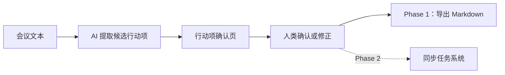
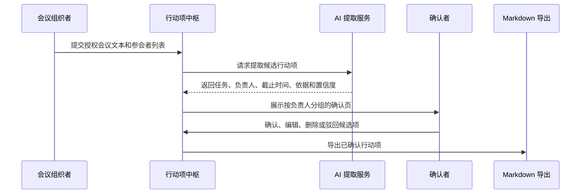
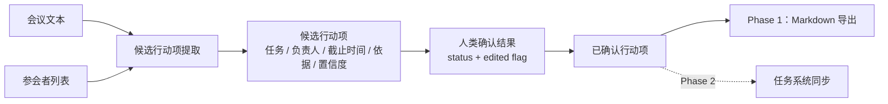

# Human PRD 样例：会后行动项中枢

## 修订记录

| 版本 | 日期 | 修订人 | 修订内容 | 依据 |
| --- | --- | --- | --- | --- |
| v1.0 | 2026-05-25 | Codex | 建立 Human PRD 样例，用于展示面向人类评审的产品逻辑、简洁表达与可读结构。 | Microsoft Work Trend Index；Atlassian 会议效率研究 |
| v1.1 | 2026-05-25 | Codex | 补充多语言范围非目标，确保与 Agent PRD 的范围约束一致。 | 双 PRD 强一致性要求 |
| v1.2 | 2026-05-25 | Codex | 重构为三段式 Human PRD，仅保留人类评审关心的“要做什么、标准是什么、如何实现”。 | Human PRD 可读性要求 |
| v1.3 | 2026-05-25 | Codex | 强化“如何实现”，补充控制流、数据流和产品路线图。 | 用户补充要求 |
| v1.4 | 2026-05-25 | Codex | 补充关键模块概要设计、技术选型决策、MVP 定义与边界说明。 | 用户补充要求 |
| v1.5 | 2026-05-25 | Codex | 统一 MVP 与路线图边界，明确 Phase 1 仅支持 Markdown 导出，并补充开放决策。 | Review 修复 |
| v1.6 | 2026-05-25 | Codex | 修正数据流中的确认状态表达，使其与 Agent PRD 状态模型一致。 | Review 修复 |
| v1.7 | 2026-05-25 | Codex | 补充编辑与确认的产品规则，明确编辑不等于确认。 | Review 修复 |
| v1.8 | 2026-05-25 | Codex | 补充状态模型、开放决策影响和路线图退出标准，使样例完整覆盖 Human PRD 模板字段。 | Review 修复 |
| v1.9 | 2026-05-25 | Codex | 补充可见风险表和 MVP 退出标准，使样例与 Human PRD 模板及输出契约一致。 | Review 修复；根因：风险与 MVP 退出标准存在于叙述和路线图中，但未作为模板要求的可见字段呈现 |
| v1.10 | 2026-05-25 | Codex | 将 MVP 核心假设改为正式假设表，补充验证需要、责任方和失效条件。 | Review 修复；根因：Human PRD 样例把 `ASM` 支撑的假设写成普通正文，未满足假设可追踪表达规则 |
| v1.11 | 2026-05-25 | Codex | 在参考依据中补充 `ASM-001` 的判断支撑与待验证边界，使显式假设完成闭环。 | Review 修复；根因：样例正文呈现了 `ASM-001`，但参考依据只解释外部来源，未说明显式假设如何支撑 MVP 判断 |
| v1.12 | 2026-05-26 | Codex | 补齐需求表的 `AC` 可见引用，并补强 `ASM-001` 的状态、依据和 resolution 可见字段。 | 收敛审计修复 |

## 1. 要做什么

会后行动项中枢面向频繁参加会议的知识工作团队，解决“会后不知道谁负责什么、什么时候完成、依据是什么”的问题。

产品在会议结束后生成一个行动项确认页，自动列出候选行动项，并要求人类确认后再导出。它不是新的项目管理系统，而是会议到任务系统之间的整理层；任务系统同步属于 Phase 2。

| 范围 | 内容 |
| --- | --- |
| 本期要做 | 从会议文本中提取候选行动项；按负责人分组；展示来源依据；支持确认、编辑、删除、驳回；导出已确认行动项。 |
| 本期不做 | 完整项目管理、看板、甘特图、资源排期；未经确认自动创建任务；处理未授权会议内容；保证中英文以外语言质量。 |
| 主要用户 | 项目负责人、团队成员、直属经理。 |
| 核心价值 | 把会议承诺转成可确认、可追踪、可进入现有工作流的任务清单。 |

### 产品形态

## 2. 标准是什么

本期成功不以“纪要是否完整”为标准，而以“行动项是否能可靠进入执行”为标准。

| 编号 | AC | 标准 | 判断方式 |
| --- | --- | --- | --- |
| REQ-001 | AC-001 | 能从会议文本中提取候选行动项。 | 每条候选项包含任务描述、负责人、截止时间、依据片段和置信度。 |
| REQ-002 | AC-002 | 能按负责人聚合行动项。 | 同一负责人的行动项归为同组；负责人缺失项进入“待确认”。 |
| REQ-003 | AC-003 | 用户能确认、编辑、删除或驳回候选项。 | 每条候选项都能被人类处理，并保留最终状态。 |
| REQ-004 | AC-004 | 已确认行动项能导出为 Markdown。 | 默认导出结果只包含已确认行动项；任务系统同步进入 Phase 2，不属于 MVP。 |
| REQ-005 | AC-005 | 每条行动项都有来源依据。 | 无依据项不得默认确认。 |

### 成功指标

| 指标 | 目标 |
| --- | --- |
| 行动项确认率 | ≥ 70% |
| 会后整理时间 | 下降 30% |
| 无依据行动项比例 | ≤ 5% |
| 错误归属投诉率 | ≤ 3% |

### 质量红线

| 红线 | 原因 |
| --- | --- |
| 不允许自动替用户承诺任务。 | 错误承诺会破坏信任。 |
| 不允许无依据行动项默认确认。 | 用户必须能判断 AI 为什么这样提取。 |
| 不允许仅因用户编辑候选项就导出。 | 编辑只是修正内容，显式确认才代表承诺进入执行。 |
| 不允许处理未授权会议内容。 | 涉及隐私与合规风险。 |

### 风险

| 风险 | 影响 | 缓解方式 |
| --- | --- | --- |
| AI 将讨论项误判为行动项。 | 可能产生错误承诺，降低团队信任。 | 只生成候选项；默认进入确认页，由人类确认后才导出。 |
| 行动项缺少来源依据。 | 用户无法判断提取是否可信。 | 缺少依据的候选项不得默认确认，并进入待确认状态。 |
| 未授权会议内容被处理。 | 可能引发隐私与合规风险。 | 输入必须是授权会议文本；未授权内容阻断处理。 |
| 过早接入任务系统。 | 会扩大 MVP 范围，分散验证重点。 | Phase 1 仅支持 Markdown 导出，任务系统同步进入 Phase 2。 |

## 3. 如何实现

采用“授权输入 + AI 提取 + 人类确认 + 轻量输出”的实现路径。核心原则是：AI 只生成候选项，人类确认后才进入执行系统。

### 控制流

### 数据流

| 数据对象 | 来源 | 处理方式 | 输出 |
| --- | --- | --- | --- |
| 会议文本 | 授权会议转写或纪要 | 仅用于提取行动项和依据片段 | 不直接进入任务系统 |
| 参会者列表 | 会议元信息 | 用于负责人匹配和待确认分组 | 负责人字段 |
| 候选行动项 | AI 提取服务 | 按负责人分组，标记置信度和依据 | 确认页 |
| 确认结果 | 人类操作 | 记录状态和编辑标记，决定是否进入输出结果 | 已确认行动项 |
| 已确认行动项 | 确认页 | Phase 1 导出；Phase 2 同步 | Markdown / 任务系统 |

### 状态模型

| 状态 | 进入条件 | 可执行操作 | 导出资格 |
| --- | --- | --- | --- |
| 待确认 | AI 生成候选行动项，或候选项缺少必要依据。 | 编辑、确认、删除、驳回。 | 不可导出。 |
| 已确认 | 人类明确点击确认。 | 编辑、删除、驳回。 | 可导出。 |
| 已驳回 | 人类判断候选项不是有效行动项。 | 不进入默认导出。 | 不可导出。 |
| 已删除 | 人类删除候选项。 | 不进入默认导出。 | 不可导出。 |

编辑只代表修正内容，不代表承诺进入执行；只有“确认”动作会让行动项具备默认导出资格。

### 关键模块概要设计

| 模块 | 职责 | 关键边界 |
| --- | --- | --- |
| 会议输入模块 | 接收授权会议文本、参会者列表和会议元信息。 | 不处理未授权录音、私密聊天或外部敏感数据。 |
| 行动项提取模块 | 从会议文本中生成候选行动项、负责人、截止时间、依据片段和置信度。 | 只生成候选项，不直接创建任务。 |
| 确认页模块 | 按负责人分组展示候选项，并支持确认、编辑、删除、驳回。 | 人类确认是进入输出结果的唯一入口。 |
| 导出模块 | 将已确认行动项导出为 Markdown。 | 默认不导出未确认、删除或驳回项。 |
| 同步模块 | 在后续阶段将已确认行动项同步到任务系统。 | 不在 Phase 1 接入，避免过早扩大范围。 |

### 技术选型决策

| 领域 | 决策 | 理由 |
| --- | --- | --- |
| AI 提取 | 使用大语言模型进行结构化抽取，输出固定字段 JSON。 | 行动项识别依赖语义理解，固定字段输出便于确认页和导出链路消费。 |
| 初始输出 | MVP 采用 Markdown 导出。 | Markdown 成本低、可读性强、便于复制到现有工具，能先验证会后整理价值。 |
| 人类确认 | 使用 Web 确认页作为主交互。 | 表格化确认、编辑和分组比聊天式确认更稳定，适合多人会议后的快速处理。 |
| 集成策略 | Phase 1 不接入任务系统，Phase 2 只选择一个主流任务系统。 | 避免在产品价值验证前消耗大量集成成本。 |
| 数据保留 | 默认只保留行动项、状态和必要来源片段。 | 降低隐私风险，避免保存超出会后执行所需的会议内容。 |

### MVP 定义与边界

MVP 围绕以下假设验证产品价值：

| 假设编号 | 状态 | 依据/来源 | 假设 | 验证需要 | 责任方 | 失效条件 | Resolution refs |
| --- | --- | --- | --- | --- | --- | --- | --- |
| ASM-001 | open | SRC-001；R1-R3；MVP 数据验证 | 团队愿意在会议后使用 AI 生成的候选行动项，并通过一次快速确认将其转成可执行清单。 | 观察行动项确认率、会后整理时间和用户对来源依据的信任反馈。 | 产品负责人 | 行动项确认率低于 70%，或会后整理时间未下降，或用户认为来源依据不足以支撑确认。 | 无，仍待 MVP 验证。 |

| 维度 | MVP 定义 |
| --- | --- |
| 必须包含 | 授权会议文本输入；候选行动项提取；负责人分组；来源依据；确认、编辑、删除、驳回；Markdown 导出。 |
| 明确不包含 | 任务系统同步；多人分发确认；完整项目管理；自动创建任务；中英文以外语言质量保证。 |
| 验证重点 | 行动项提取是否有用；确认页是否降低会后整理成本；用户是否信任带依据的候选项。 |
| 成功门槛 | 行动项确认率达到 70%；会后整理时间下降 30%；无依据行动项比例不超过 5%。 |
| 退出标准 | MVP 达到成功门槛，且未出现自动承诺任务、无依据默认确认、未授权内容处理或 Phase 1 范围扩张。 |

### 开放决策

| 决策 | 影响 | 所属阶段 | 当前结论 |
| --- | --- | --- | --- |
| 首个任务系统集成选择 Jira、Linear 还是 Asana。 | 决定首个同步适配器、字段映射和错误处理方式。 | Phase 2 | 不影响 MVP；在确认 Markdown 导出价值后再选择一个主集成。 |
| 是否支持按负责人分别确认行动项。 | 影响确认链路、通知方式和确认责任归属。 | Phase 3 | MVP 默认由会议组织者统一确认。 |
| 行动项来源片段的保留周期。 | 影响隐私合规、存储策略和后续审计能力。 | Phase 1 | MVP 仅保留必要来源片段；具体保留周期需结合隐私要求确认。 |

### 产品路线图

| 阶段 | 目标 | 交付重点 | 不做事项 | 退出标准 |
| --- | --- | --- | --- | --- |
| Phase 1：单会议闭环 | 验证行动项提取和人类确认是否成立。 | 支持中文、英文会议文本；生成确认页；支持编辑、删除、驳回；Markdown 导出。 | 不接入任务系统，不做多人协同确认。 | 行动项确认率达到 70%，会后整理时间下降 30%，且无依据行动项比例不超过 5%。 |
| Phase 2：工作流接入 | 让确认后的行动项进入团队现有工具。 | 接入一个主流任务系统；保留 Markdown 导出；增加同步结果反馈。 | 不建设完整项目管理能力。 | 选定一个主集成并验证同步结果可被团队接受。 |
| Phase 3：多人确认 | 降低会议组织者的确认负担。 | 支持按负责人分发确认；记录确认人和确认时间。 | 不自动替负责人承诺任务。 | 负责人确认流程不显著增加会后整理负担。 |
| Phase 4：质量优化 | 提升提取准确性和可审计性。 | 增加低置信度解释、错误归属反馈、指标看板。 | 不扩展到未授权或敏感数据源。 | 错误归属投诉和无依据行动项比例持续下降。 |

## 参考依据

Atlassian 对知识工作者的调研显示，会议被认为是生产力的重要障碍，且许多参会者离开会议后并不清楚下一步行动。[R1][R2] Microsoft Work Trend Index 显示，80% 的受访者希望 AI 帮助总结会议和行动项。[R3]

这些资料支持本产品判断：用户需要的不是更长的会议纪要，而是更可靠的会后执行衔接。

`ASM-001` 支撑 MVP 的验证重点：本期以行动项确认率、会后整理时间和来源依据可信度验证“AI 候选项 + 人类确认”是否成立。该假设仍需通过 MVP 数据验证，不能被写成已确认事实。

## 参考文献

[R1] Atlassian. “Meeting overload is real – here’s what to do about it.” https://www.atlassian.com/blog/productivity/replace-meetings-asynchronous-collaboration

[R2] Atlassian. “Workplace Woes: Meetings.” https://www.atlassian.com/blog/workplace-woes-meetings

[R3] Microsoft WorkLab. “Work Trend Index: Will AI Fix Work?” https://www.microsoft.com/en-us/worklab/work-trend-index/will-ai-fix-work/
