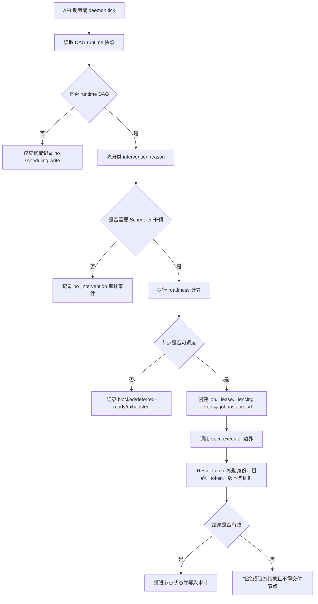

## 修订记录

| 版本 | 日期 | 作者 | 修订内容 | 依据/审批 |
| --- | --- | --- | --- | --- |
| v1.2 | 2026-05-30 | Codex | 根据人工 review 修复发布灰度、监控支持、度量责任归属与方法论引用落点，使 PRD 更符合 release safety、measurement ownership 与 traceability 最佳实践。 | 用户指令；[S02][S03][S04][S05][S06][M03][M07][M11][M14][M15] |
| v1.1 | 2026-05-30 | Codex | 按加硬后的 PRD 写作技能重新生成并复核，补强正文方法论落点、摘要事实引用闭环与交付前门禁验证要求。 | 用户指令；[S01][S02][S03][S04][S05][S06][M01][M03][M07][M11][M14][M15] |
| v1.0 | 2026-05-30 | Codex | 基于既有 Scheduler PRD、合同信封、HLD 与验收夹具重写为正式中文 PRD，补齐修订记录、结构化范围、需求表、验收矩阵、度量方案、发布路径、风险与追踪矩阵。 | 用户指令；[S01][S02][S03][S04][S05][S06] |

## 文档摘要

| 项目 | 内容 |
| --- | --- |
| 产品名称 | Scheduler daemon for runtime DAG orchestration。[S02] |
| 文档目的 | 为 Scheduler 的产品边界、功能需求、验收标准、发布路径和风险控制提供人类可读、可追踪、可验收的 PRD。[S02][S03][M01][M07] |
| 目标读者 | 产品负责人、架构设计者、研发、测试、运维、审计与后续执行 Agent。[S02][S03] |
| 当前状态 | 基于已批准 Human PRD、execution-ready Agent PRD 与已完成 Stage 3 HLD 合同状态形成的门禁通过版 PRD。[S01][S02][S03][S04] |
| 事实来源 | 既有 Human PRD、Agent PRD、contract-envelope、HLD、验收脚本与真实夹具。[S01][S02][S03][S04][S05][S06] |

Scheduler 是一个独立 daemon 与 API 控制面，用于将既有 workflow DAG runtime instance 推进为确定性、可恢复、可审计的 job state stream；它不设计路由、不创建 DAG 节点、不直接执行任务、不修改交付物，也不把 `Executor completed` 直接等同于节点交付完成。[S01][S02][S03]

本文档采用面向跨职能对齐的 PRD 结构，先说明产品目的、读者与事实来源，再进入问题、目标、范围、需求、验收和发布控制。[M01]

## 背景与问题

现有 workflow 路由已经定义 DAG，Executor 负责执行任务；Scheduler 的产品职责是作为二者之间保守的状态裁决层，判断节点何时可调度、Executor 结果何时可接受、执行权何时过期，以及 DAG 何时被阻塞或耗尽。[S02][S03]

该产品需要解决四类核心问题：调度行为不可隐藏、状态推进必须基于持久化证据、重复 tick 或重复回调不得造成重复交付、审计人员必须能够解释每一次 dispatch、accept、reject、expire、block、defer、recover 与 route_exhausted 决策。[S02][S03][S04]

## 目标与成功指标

目标与指标采用 outcome-first 写法，先定义产品结果，再给出可验证口径与阈值，避免把功能清单误当成产品成功。[M03][M11]

| ID | 目标 | 指标定义 | 目标值 | 依据 |
| --- | --- | --- | --- | --- |
| G-001 | 保持 Scheduler 的状态控制边界 | route definition mutation、node generation、direct command execution、deliverable mutation 均不得通过 Scheduler 发生。 | 0 次违规 | [S02][S03] |
| G-002 | 确保 runtime DAG 推进确定且可恢复 | 每一次状态变更均由持久化状态、readiness、lease、fencing token 与证据驱动。 | 所有关键路径均有审计事件 | [S02][S03][S04] |
| G-003 | 确保 Executor 集成边界清晰 | 调度输出必须生成 `job-instance.v1`，并通过 `spec-executor run --job-instance <job-instance.json> --result-output <executor-result.json>` 边界交互。 | 所有 dispatch 均可追踪到 job、lease、fencing token 与 node version | [S02][S03][S04] |
| G-004 | 确保验收可复现 | API、runtime loop、readiness、dispatch、result validation、idempotency、recovery、fairness、permissions、audit 与 exhaustion 均由真实夹具覆盖。 | acceptance matrix 覆盖率 100% | [S02][S05][S06] |

```latex
\text{验收覆盖率}=\frac{\text{通过真实夹具验证的验收域数量}}{\text{PRD声明的验收域总数量}}
```

## 用户与使用场景

| 用户/角色 | 核心诉求 | 典型场景 | 依据 |
| --- | --- | --- | --- |
| Workflow 平台操作员 | 安全推进多个 runtime DAG，并查询状态而不修改路由定义。 | 查询 DAG/runtime、触发 tick、观察 blocked/exhausted 状态。 | [S02][S03] |
| Executor 集成服务 | 获取精确的 `job-instance.v1` payload，并通过确定边界回传执行结果。 | Scheduler 生成 job instance 后调用 `spec-executor`，Result Intake 校验结果。 | [S02][S03][S04] |
| 审计与评审人员 | 复盘调度、租约、结果接受、拒绝、过期、阻塞、耗尽与 no-op 决策。 | 读取 audit events、result decisions、lease records 与 state-transition events。 | [S02][S05][S06] |
| 后续 HLD/实现 Agent | 在不发明产品事实的前提下完成设计与实现。 | 从 PRD/HLD/contract refs 派生接口、数据对象、状态机与验收检查。 | [S02][S03][S04] |

## 范围定义

范围定义同时列出范围内、范围外、假设和约束，用于控制 scope creep 并保护 Scheduler 的状态控制边界。[M11]

| 类型 | 内容 | 说明 | 依据 |
| --- | --- | --- | --- |
| 范围内 | daemon API、runtime DAG state、query-only non-runtime DAG、intervention-first loop、readiness、next-job calculation、Executor `job-instance.v1` 集成、证据校验、idempotency、lease/fencing、recovery、multi-DAG fairness、permissions、audit、route exhaustion、真实验收矩阵。 | 这些能力构成 Scheduler MVP 与可靠性强化的产品边界。 | [S02][S03] |
| 范围外 | 路由设计、新节点生成、直接执行命令、修改交付物、绕过证据、将 Executor completed 直接视为 delivered、在 route_exhausted 时宣告业务成功、生成实现任务计划。 | 这些行为会破坏 Scheduler 作为状态控制层的边界。 | [S02][S03] |
| 假设 | HLD 与实现阶段以 `contract-envelope.json` 为事实源，以既有 PRD 为同级渲染产物。 | 当设计细节没有 canonical object 支撑时，必须提出封闭式澄清或阻塞。 | [S02][S03] |
| 约束 | 验收必须使用真实 `spec-scheduler`、真实 DAG/runtime fixtures 与真实 Executor result samples，不得使用 mock、stub、fake、simulated、synthetic 或 placeholder 数据。 | 该约束用于防止不可复现验收。 | [S02][S05][S06] |

## 用户旅程与业务流程



## 功能需求

| ID | 优先级 | 需求 | 说明 | 依据 | 验收标准 |
| --- | --- | --- | --- | --- | --- |
| FR-001 | P0 | Scheduler 必须只消费既有路由/runtime 状态与 Executor 结果，不得拥有路由设计、节点生成、任务执行、命令执行或交付物修改职责。 | 这是产品边界的最高优先级要求。 | [S02][S03] | AC-001 |
| FR-002 | P0 | Scheduler 必须区分 DAG definition 与 DAG runtime instance；非 runtime DAG 只能查询，不得发生 scheduling write。 | 防止静态或非运行态 DAG 被误推进。 | [S02][S03] | AC-002 |
| FR-003 | P0 | daemon main loop 必须逐个检查 runtime DAG，并在 next-job calculation 之前先记录 intervention reason。 | 干预优先是 runtime loop 的核心控制语义。 | [S02][S03] | AC-003 |
| FR-004 | P0 | readiness 必须基于依赖完成度、节点状态、权限、active lease、retry、全局容量与单 DAG 容量进行确定性判断。 | 不得依赖主观文本或隐式判断。 | [S02][S03][S04] | AC-004 |
| FR-005 | P0 | 对可调度节点，Scheduler 必须生成可追踪的 `job-instance.v1`，并持久化 job、lease、fencing token、node version 与 audit evidence。 | Executor 输入与调度身份必须可追踪。 | [S02][S03][S04] | AC-005 |
| FR-006 | P0 | Scheduler 必须通过 `spec-executor run --job-instance <job-instance.json> --result-output <executor-result.json>` 作为所需集成边界调用 Executor。 | 当前本地证据记录该 executable 尚未被发现，因此这是必须提供的集成合同，不是现有二进制声明。 | [S02][S03][S04] | AC-006 |
| FR-007 | P0 | Result Intake 必须校验 Executor identity、job id、lease id、fencing token、node version、evidence refs 与 mechanical checks。 | 只有证据有效的结果可推进节点状态。 | [S02][S03] | AC-007 |
| FR-008 | P0 | 重复 tick、重复结果、daemon restart 与 stale token/version 场景不得造成重复 active job 或重复 accepted transition。 | idempotency 与 recovery 是可靠性硬边界。 | [S02][S03] | AC-008 |
| FR-009 | P1 | 多 runtime DAG 调度必须采用公平策略与容量预算，并在容量不足时记录 deferred-ready reason。 | 防止单一 DAG 长期垄断调度能力。 | [S02][S03][S04] | AC-009 |
| FR-010 | P0 | 所有 dispatch、no-op、accept、reject、expire、block、recover、defer、route_exhausted 决策必须产生 append-only audit event。 | 审计事件必须包含 actor、DAG runtime id、前后状态、reason、evidence refs、timestamp 等信息。 | [S02][S03][S04] | AC-010 |
| FR-011 | P0 | `route_exhausted` 只表达路由耗尽或无可调度节点，不得表达 business_success 或 project_done。 | Scheduler 不是业务成功裁决者。 | [S02][S03] | AC-011 |
| FR-012 | P0 | API 必须暴露 DAG/runtime 查询、runtime lifecycle、tick、Executor result intake 与 audit 查询能力，同时拒绝 route-definition mutation。 | API 控制面服务于状态控制，不授予路由设计权。 | [S02][S03][S04] | AC-012 |

## 非功能需求与约束

非功能需求以确定性、可恢复性、幂等性、审计性、权限安全和可验收性为主，确保 PRD 不只描述功能行为，也覆盖软件交付质量约束。[M14]

| ID | 类别 | 要求 | 验证方式 | 依据 |
| --- | --- | --- | --- | --- |
| NFR-001 | 确定性 | 所有 readiness、dispatch、result acceptance 与 state transition 均必须由持久化状态和明确规则派生。 | 审查 state-transition events 与 audit events。 | [S02][S03] |
| NFR-002 | 可恢复性 | daemon 重启后必须先 reconcile expired leases 与 pending results，再进行新 dispatch。 | recovery 验收域通过。 | [S02][S05][S06] |
| NFR-003 | 幂等性 | 重复 tick、重复 result callback、重复 dispatch attempt 不得产生重复 active job 或重复 accepted transition。 | idempotency 验收域通过。 | [S02][S03] |
| NFR-004 | 审计性 | 当前状态表与 append-only audit events 必须同时存在；状态变更与审计事件必须在同一事务内写入。 | 检查 SQLite rows 与 audit event schema。 | [S03][S04] |
| NFR-005 | 权限与安全 | 未授权 caller、DAG/runtime、node、Executor identity、lease、token 或 evidence access 必须被拒绝且不得推进状态。 | permissions 验收域通过。 | [S02][S03] |
| NFR-006 | 可验收性 | 验收不得使用 mock、stub、fake、simulated、synthetic、placeholder 或 deferred acceptance inputs。 | 验收脚本与 fixture 路径检查。 | [S02][S05][S06] |

## 数据、埋点与度量方案

度量方案以可复现验收产物为看板来源，并为每项指标指定责任角色，确保指标不是文档装饰，而是发布、回滚和验收决策依据。[M03][M11]

| ID | 事件/指标 | 定义 | 输出/属性 | 看板/负责人 | 决策阈值 | 依据 |
| --- | --- | --- | --- | --- | --- | --- |
| MET-001 | boundary_violation_count | route mutation、node generation、direct command execution、artifact mutation 的违规次数。 | audit_events、API rejection records。 | Scheduler acceptance report；产品负责人/架构负责人。 | 必须为 0。 | [S02][S03] |
| MET-002 | accepted_result_evidence_rate | accepted result 中具备有效 identity、job、lease、fencing token、node version 与 evidence refs 的比例。 | result-decisions.json、audit-events.jsonl。 | Result intake acceptance report；测试负责人。 | 必须为 100%。 | [S02][S05][S06] |
| MET-003 | duplicate_transition_count | 同一 node generation 出现重复 active job 或重复 accepted transition 的次数。 | job-instances.json、state-transition-events.jsonl。 | Idempotency/recovery acceptance report；研发负责人。 | 必须为 0。 | [S02][S05] |
| MET-004 | acceptance_domain_coverage | 真实验收矩阵覆盖的验收域数量占 PRD 声明验收域数量的比例。 | scheduler-run-report.json。 | Release readiness report；测试负责人/发布负责人。 | 必须为 100%。 | [S02][S05][S06] |
| MET-005 | audit_explainability_rate | 关键状态事件具备 actor、runtime、node/job/lease、previous_state、next_state、reason、evidence_refs、timestamp 的比例。 | audit-events.jsonl。 | Audit acceptance report；审计/运维负责人。 | 必须为 100%。 | [S03][S04][S05] |

## 验收标准

| ID | 对应需求 | 验收标准 | 验证方式 | 依据 |
| --- | --- | --- | --- | --- |
| AC-001 | FR-001 | Given 既有 route 与 runtime state，When Scheduler 处理状态，Then route definition、node set、task command 与 deliverable 均不得被 Scheduler 修改。 | API 与状态持久化检查。 | [S02][S03] |
| AC-002 | FR-002 | Given 一个非 runtime DAG 与一个 runtime DAG，When daemon tick 运行，Then 非 runtime DAG 只产生 query/no-op 行为，runtime DAG 才进入调度判断。 | runtime loop 验收域。 | [S02][S05] |
| AC-003 | FR-003 | Given runtime DAG 需要推进，When Scheduler 处理该 DAG，Then intervention reason 必须先于 next-job calculation 被记录。 | audit event 顺序检查。 | [S02][S03] |
| AC-004 | FR-004 | Given 依赖未完成、权限不足、active lease、retry 限制或容量不足的节点，When readiness 计算，Then 节点不得成为 dispatch candidate。 | readiness 验收域。 | [S02][S05] |
| AC-005 | FR-005 | Given 一个可调度节点，When dispatch 成功，Then `job-instance.v1` 必须包含所需字段并可追踪到 DAG/node/job/lease/fencing token/node version。 | job-instances.json 与 lease-records.json 检查。 | [S02][S05][S06] |
| AC-006 | FR-006 | Given `spec-executor` 集成边界可用，When Scheduler 调用 Executor，Then 必须使用声明的命令参数并捕获 stdout、stderr、exit code 与 result-output。 | Executor gateway 集成检查。 | [S03][S04] |
| AC-007 | FR-007 | Given 成功、缺失证据、错误身份、stale version/token、mechanical checks failed 的结果样本，When Result Intake 处理，Then 只有证据有效的结果被 accepted，其余不得推进节点。 | result-decisions.json 检查。 | [S02][S06] |
| AC-008 | FR-008 | Given 重复 tick、重复结果或 daemon restart，When Scheduler 恢复处理，Then 不得产生重复 active job 或重复 accepted transition。 | idempotency/recovery 验收域。 | [S02][S05] |
| AC-009 | FR-009 | Given 多个 runtime DAG 超过 dispatch capacity，When daemon pass 运行，Then 全局/单 DAG 容量限制生效，并记录 deferred-ready reason。 | fairness/capacity 验收域。 | [S02][S03] |
| AC-010 | FR-010 | Given 任一关键决策事件，When 决策提交，Then 对应 audit event 必须具备可复盘字段，且不得被原地更新。 | audit-events.jsonl 检查。 | [S03][S04][S05] |
| AC-011 | FR-011 | Given 无 active job 且无可调度节点，When Scheduler 写入 route_exhausted，Then 事件不得声明 business_success 或 project_done。 | exhaustion 验收域。 | [S02][S05] |
| AC-012 | FR-012 | Given API caller 请求查询、lifecycle、tick、result intake、audit 或 route mutation，When API 处理请求，Then 合法控制/查询请求可执行，route mutation 必须被拒绝且不写状态。 | API 验收域。 | [S02][S03] |

## 发布、灰度与回滚

发布方案采用阶段化 release safety 结构：每个阶段都必须明确灰度范围、监控项、支持责任和回滚/阻断动作，避免只有路线图而缺少上线控制。[M11]

| 阶段 | 范围 | 灰度范围 | 进入条件 | 监控项 | 支持/负责人 | 退出条件 | 回滚/阻断动作 | 依据 |
| --- | --- | --- | --- | --- | --- | --- | --- | --- |
| Phase 1 - PRD/HLD 冻结 | 完成可评审 PRD 与可实现 HLD。 | 文档评审范围，不进入运行环境。 | PRD 与 contract refs 完整。 | 引用闭环、HLD 覆盖率、真实验收设计完整性。 | 产品负责人、架构负责人。 | Human PRD approved；HLD 覆盖 API、数据对象、事务、真实验收。 | 若 HLD 需要发明未引用接口、状态字段或验收方法，则阻断进入实现。 | [S02][S03] |
| Phase 2 - Scheduler MVP 控制面 | daemon baseline、API、权威状态、runtime loop、readiness、dispatch、result intake。 | 本地真实 fixture 与受控 runtime DAG。 | HLD 已批准；`job-instance.v1` 边界确认；真实夹具可用。 | boundary_violation_count、accepted_result_evidence_rate、acceptance_domain_coverage。 | 研发负责人、测试负责人。 | query-only、intervention-first、有效 dispatch 与证据推进通过验收。 | 若非 runtime DAG 被调度或 result 无证据推进，则停止发布并回退到 HLD/实现修订。 | [S02][S03][S05][S06] |
| Phase 3 - 可靠性与审计强化 | idempotency、lease/fencing、restart recovery、stale result rejection、fairness、permissions、durable audit。 | 多 runtime DAG、重复 tick/result、daemon restart 与权限负向场景。 | Phase 2 真实验收通过。 | duplicate_transition_count、audit_explainability_rate、stale token rejection。 | 研发负责人、运维负责人、审计负责人。 | duplicate/stale/restart/fairness/permission/audit 场景通过。 | 若重复 active job、重复 accepted transition 或 stale token 被接受，则回退到 Phase 2 并阻断运行就绪。 | [S02][S03][S04] |
| Phase 4 - 运行就绪 | 操作可视性、route exhaustion 语义、STOP 条件负向覆盖。 | 操作员可查询的完整 acceptance-run 输出目录。 | Phase 3 可靠性验收通过。 | route_exhausted 语义、STOP 条件覆盖、DAG/job/lease/result/audit 查询完整性。 | 发布负责人、运维负责人、审计负责人。 | operator 可查询 DAG/job/lease/result/audit；STOP 条件具备负向覆盖。 | 若 route_exhausted 被解释为业务成功或 STOP 条件无负向覆盖，则阻断上线并补齐验收。 | [S02][S03][S04][S05] |

## 依赖、风险与开放问题

| 类型 | ID | 内容 | 影响 | 处理方式 | 状态 | 依据 |
| --- | --- | --- | --- | --- | --- | --- |
| 依赖 | DEP-001 | `spec-executor` 命令边界必须由实现或集成环境提供。 | 若不可用，最终 runtime acceptance 不能通过。 | 保留 DCT-018 为必需合同；不得声称当前已有二进制。 | 未实现风险 | [S02][S03][S04] |
| 依赖 | DEP-002 | 真实 DAG/runtime fixture 与 Executor result samples 必须存在并可被 acceptance runner 消费。 | 若缺失，验收不可复现。 | 使用 `docs/acceptance/scheduler-runtime-fixtures.json` 与 `executor-result-samples.json`。 | 已有源文件 | [S05][S06] |
| 风险 | RISK-001 | Scheduler 漂移为 planner、executor 或 success judge。 | 产品边界失效，审计不可解释。 | 通过范围外、STOP 条件、API mutation rejection 与 route_exhausted 语义约束控制。 | 受控 | [S02][S03] |
| 风险 | RISK-002 | Executor completed 被误当作 delivered。 | 错误推进 DAG 状态。 | Result Intake 必须执行证据、身份、token、版本和 mechanical checks。 | 受控 | [S02][S03][S06] |
| 风险 | RISK-003 | daemon 重启或重复 tick 造成重复调度。 | 产生重复执行与状态不一致。 | 使用 scheduling_key、lease、fencing token、update_version 与 recovery reconcile。 | 受控 | [S02][S03] |
| 开放问题 | OQ-001 | 最终实现环境是否已经提供可调用的 `spec-executor`。 | 影响 Phase 2/最终验收。 | 实现阶段必须验证命令存在或提供替代但等价的合同实现。 | 待实现确认 | [S03][S04] |

## 需求追踪矩阵

需求追踪矩阵用于把来源、目标、需求、验收标准和指标串成闭环，确保后续评审能定位每个交付判断的依据。[M07][M15]

| 来源 | 目标 | 需求 | 验收标准 | 指标/监控 |
| --- | --- | --- | --- | --- |
| [S02][S03] | G-001 | FR-001, FR-002, FR-011, FR-012 | AC-001, AC-002, AC-011, AC-012 | MET-001 |
| [S02][S03][S04] | G-002 | FR-003, FR-004, FR-008, FR-009, FR-010 | AC-003, AC-004, AC-008, AC-009, AC-010 | MET-003, MET-005 |
| [S02][S03][S04] | G-003 | FR-005, FR-006, FR-007 | AC-005, AC-006, AC-007 | MET-002 |
| [S02][S05][S06] | G-004 | FR-001 至 FR-012 | AC-001 至 AC-012 | MET-004 |

## 参考文献

| 来源ID | 名称 | 链接/位置 | 引用日期 |
| --- | --- | --- | --- |
| [S01] | Scheduler Human PRD | `C:\Users\54256213\Documents\github\spec-scheduler\docs\human-prd.md` | 2026-05-30 |
| [S02] | Scheduler Agent PRD | `C:\Users\54256213\Documents\github\spec-scheduler\docs\agent-prd.md` | 2026-05-30 |
| [S03] | Scheduler Contract Envelope | `C:\Users\54256213\Documents\github\spec-scheduler\docs\contract-envelope.json` | 2026-05-30 |
| [S04] | Scheduler High Level Design | `C:\Users\54256213\Documents\github\spec-scheduler\docs\high-level-design.md` | 2026-05-30 |
| [S05] | Scheduler Runtime Fixtures | `C:\Users\54256213\Documents\github\spec-scheduler\docs\acceptance\scheduler-runtime-fixtures.json` | 2026-05-30 |
| [S06] | Executor Result Samples | `C:\Users\54256213\Documents\github\spec-scheduler\docs\acceptance\executor-result-samples.json` | 2026-05-30 |
| [M01] | Atlassian, What is a Product Requirements Document (PRD)? | https://www.atlassian.com/agile/product-management/requirements | 2026-05-30 |
| [M03] | Aha!, PRD Templates: What To Include for Success | https://www.aha.io/roadmapping/guide/requirements-management/what-is-a-good-product-requirements-document-template | 2026-05-30 |
| [M07] | Perforce, How to Write a PRD | https://www.perforce.com/blog/alm/how-write-product-requirements-document-prd | 2026-05-30 |
| [M11] | Product Blueprint, PRD Essential Guide | https://product-blueprint.com/prd-product-requirements-document/ | 2026-05-30 |
| [M14] | Behutiye et al., Non-functional Requirements Documentation in Agile Software Development | https://arxiv.org/abs/1711.08894 | 2026-05-30 |
| [M15] | Knauss and Boustani, A Quality Framework for Agile Requirements | https://arxiv.org/abs/1406.4692 | 2026-05-30 |
