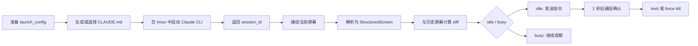

# Claude Tmux CLI Adapter 产品需求文档（人类版）

来源契约：`REF-001`（`contract-envelope.json`）

文档状态：`review_ready`

## 修订表

| 版本 | 日期 | 修订人 | 修订内容 | 依据 |
| --- | --- | --- | --- | --- |
| v1.0 | 2026-05-26 | Codex | 形成面向人工评审的初版产品需求文档。 | `SRC-001`; `META-001` |
| v1.1 | 2026-05-26 | Codex | 补齐产品范围、验收标准、实现边界、风险与阶段退出标准。 | `RB-001`; `RB-002`; `CORE-001` |
| v1.2 | 2026-05-26 | Codex | 对齐 canonical contract 引用、假设处理和任务拆解闭环。 | `REF-001`; `ASM-001`; `ASM-002`; `ASM-003` |
| v1.3 | 2026-05-26 | Codex | 按人类 PRD 写作要求统一为专业简体中文，强化结论表达、结构层次和出处标记。 | `REF-001`; `SRC-001` |

## 1. 产品定位

Claude Tmux CLI Adapter 是一个 Rust 命令行应用，用于在 tmux 会话中启动、观察、控制和结束 Claude CLI。它面向需要把 Claude CLI 纳入自动化执行链路的开发者和运行方，提供可重复、可验证、结构化的会话控制能力。`CORE-001` `USER-001`

该产品不承担 Claude 语义理解职责，也不判断 Claude 回复内容是否正确。它只负责机械地操作 tmux、捕捉屏幕、解析屏幕结构、计算状态差异、发送输入并返回证据。`BAR-001` `OOS-001`

| 项目 | 结论 | 依据 |
| --- | --- | --- |
| 产品名称 | Claude Tmux CLI Adapter | `CORE-001` |
| 产品形态 | Rust CLI 应用 | `TECH-001` |
| 运行边界 | 本地 tmux 会话中的 Claude CLI | `TECH-002`; `ASM-001` |
| 核心价值 | 为自动化系统提供确定、结构化、可验证的 Claude CLI 控制层 | `CORE-001`; `SRC-001` |
| 目标用户 | 自动化运行方、agent runtime 开发者、spec driven development 工具集成者 | `USER-001`; `CORE-001` |

## 2. 阶段范围

本阶段目标是交付一个本地可用的机械 tmux 适配器，覆盖启动、捕捉、状态判断、输入确认和结束会话五项能力。`PHASE-001` `SCOPE-001`

| 范围类型 | 内容 | 依据 |
| --- | --- | --- |
| 本期必须包含 | 配置环境与 `CLAUDE.md`，在 tmux 中启动 Claude CLI，并返回 session id | `REQ-001`; `OUT-001` |
| 本期必须包含 | 捕捉指定 tmux session 的当前屏幕，并输出结构化内容 | `REQ-002`; `OUT-002` |
| 本期必须包含 | 基于当前与历史结构化屏幕 diff，机械识别 idle/busy 状态 | `REQ-003`; `OUT-003` |
| 本期必须包含 | 向指定 session 输入指令、触发执行，并在 1 秒后捕捉屏幕确认 | `REQ-004`; `OUT-004` |
| 本期必须包含 | 通过 `/exit` 或 force kill 结束 tmux session | `REQ-005`; `OUT-005` |
| 本期不包含 | Claude 回复语义理解、远程编排、多主机 tmux 管理、非 tmux 终端后端 | `OOS-001` |

## 3. 用户流程

用户需要一个可以被上层程序稳定调用的 CLI，而不是依赖人工观察终端。推荐使用流程如下。`FLOW-001`



## 4. 功能需求

| ID | 功能 | 人类可理解的验收结论 | 输出 | 依据 |
| --- | --- | --- | --- | --- |
| `REQ-001` | 启动会话 | 给定配置、权限、`CLAUDE.md` 和任务提示后，CLI 能启动 Claude CLI tmux 会话，并返回非空 session id 与启动元数据。 | `OUT-001` | `AC-001`; `VER-001` |
| `REQ-002` | 捕捉屏幕 | 给定有效 session id 后，CLI 能返回原始屏幕、消息区、输入区、解析状态和捕捉时间。 | `OUT-002` | `AC-002`; `VER-002` |
| `REQ-003` | 判断状态 | 给定当前与历史结构化屏幕后，CLI 能返回 idle/busy、结构化 diff 和规则命中信息。 | `OUT-003` | `AC-003`; `VER-003` |
| `REQ-004` | 输入指令 | 给定 session id 和指令后，CLI 能发送文本、触发执行、等待 1 秒并返回确认捕捉证据。 | `OUT-004` | `AC-004`; `VER-004` |
| `REQ-005` | 结束会话 | 给定 session id 后，CLI 能按模式执行 `/exit` 或 force kill，并报告最终 session 状态。 | `OUT-005` | `AC-005`; `VER-005` |

## 5. 验收标准

本产品的验收重点是“机械、结构化、可验证”。只要任一核心能力缺少结构化输出、停止条件或验证证据，就不能视为本阶段完成。`BAR-003` `DONE-001` `DONE-005`

| 验收维度 | 必须达到的标准 | 阻断性 | 依据 |
| --- | --- | --- | --- |
| 启动可靠性 | 启动成功时必须返回可用 session id；启动失败时必须返回结构化失败结果。 | 是 | `AC-001`; `STOP-001` |
| 捕捉可靠性 | 捕捉结果必须保留 raw screen，并给出 messages、input、status 等结构化字段。 | 是 | `AC-002`; `DCT-002` |
| 状态判断准确性 | idle 准确率和 busy 准确率均必须在标注语料上达到 99% 以上。 | 是 | `MET-001`; `MET-002`; `VER-006` |
| 输入确认 | 输入后必须等待 1 秒并捕捉屏幕，不能无证据声明输入成功。 | 是 | `AC-004`; `EXE-004` |
| 终止行为 | `/exit` 和 force kill 必须区分模式、结果和最终 session 存在状态。 | 是 | `AC-005`; `STOP-005` |

状态判断的准确率目标可表示为：

```latex
\text{Idle Accuracy} \ge 99\%, \quad \text{Busy Accuracy} \ge 99\%
```

## 6. 实现约束

实现必须保持机械性和确定性。状态判断只能来自屏幕结构和 diff 规则，不能调用大模型，也不能根据 Claude 消息语义进行推断。`TECH-003` `BAR-001`

| 约束 | 具体要求 | 依据 |
| --- | --- | --- |
| CLI 技术栈 | 使用 Rust 实现命令行应用，便于测试、类型约束和结构化输出。 | `TECH-001` |
| 会话边界 | 仅使用 tmux 作为本阶段会话边界。 | `TECH-002`; `OOS-001` |
| 屏幕解析 | 屏幕内容必须用机械规则解析为结构化字段。 | `MOD-004`; `DCT-002` |
| 状态判断 | idle/busy 必须由结构化 diff 和规则命中得出。 | `MOD-005`; `DCT-003` |
| 命令输出 | 所有命令必须返回明确的 success/failure、evidence 和 error 字段。 | `DCT-004`; `BAR-003` |

## 7. 风险与应对

| 风险 | 影响 | 应对 | 依据 |
| --- | --- | --- | --- |
| Claude CLI 屏幕格式变化 | 解析规则可能失效，影响捕捉和状态判断可靠性。 | 建立版本化 parser fixtures；无法机械解析时返回 parser status 或结构化失败。 | `RISK-001`; `STOP-002` |
| 缺少标注语料 | 无法证明 99% idle/busy 准确率。 | 将标注 screen-diff corpus 作为 release gate；未达标时阻断发布。 | `RISK-002`; `VER-006` |
| tmux 输入转义失败 | 特殊字符或多行 prompt 可能未被正确送达。 | 建立转义测试，并以 1 秒后捕捉结果作为确认依据。 | `RISK-003`; `AC-004` |
| 本地运行环境不满足假设 | 缺少 tmux 或 Claude CLI 时无法完成会话控制。 | 启动前执行 preflight；失败时返回结构化停止结果。 | `ASM-001`; `STOP-001` |

## 8. 阶段完成定义

| Done ID | 完成定义 | 验证依据 |
| --- | --- | --- |
| `DONE-001` | 能启动配置化 Claude CLI tmux 会话，并返回可用 session id。 | `VER-001`; `AC-001` |
| `DONE-002` | 能结构化返回 raw screen、messages、input 和 parser status。 | `VER-002`; `AC-002` |
| `DONE-003` | 能返回 idle/busy diff，并通过 99%/99% 准确率门禁。 | `VER-003`; `VER-006`; `AC-003` |
| `DONE-004` | 能完成输入、回车、1 秒等待、确认捕捉和结构化结果返回。 | `VER-004`; `AC-004` |
| `DONE-005` | 能可靠执行 graceful `/exit` 和 force kill，并返回结构化终止结果。 | `VER-005`; `AC-005` |

## 9. 非阻塞假设

以下假设不阻塞 PRD 评审，但会影响实现和发布判断；实现阶段不得静默扩大假设范围。`ASM-001` `ASM-002` `ASM-003`

| ID | 假设 | 验证要求 | 失效条件 | 执行处理 |
| --- | --- | --- | --- | --- |
| `ASM-001` | 目标运行环境是本地类 Unix 环境，tmux 和 Claude CLI 可通过 subprocess 调用。 | 启动或捕捉测试前验证 tmux 与 Claude CLI 可用。 | preflight 或环境文档证明运行条件后失效。 | 不满足时返回 `STOP-001` 或 `STOP-002`。 |
| `ASM-002` | 权限设置可由 CLI 参数、环境变量或生成配置文件表达。 | 实现时选择唯一表达方式，并在启动元数据中暴露。 | `OUT-001` 和测试证明权限表达方式后失效。 | 选择后写入 launch metadata。 |
| `ASM-003` | 99% 准确率以实现方维护的标注屏幕语料衡量。 | 建立或导入标注语料，并执行准确率统计。 | `VER-006` 证明两项准确率均达标后失效。 | 任一指标低于 99% 时不得标记完成。 |

## 参考文献

| ID | 类型 | 说明 |
| --- | --- | --- |
| `SRC-001` | 用户原始输入 | 定义 Rust CLI、Claude CLI、tmux、五项机械能力、1 秒确认和 99%/99% 准确率要求。 |
| `REF-001` | canonical contract | 本 PRD 的结构化事实来源，包含需求、验收、执行规则、数据契约、停止条件和完成定义。 |
| `REF-003` | agent PRD | 面向执行 agent 的同源渲染文档，用于约束实现和任务拆解。 |
