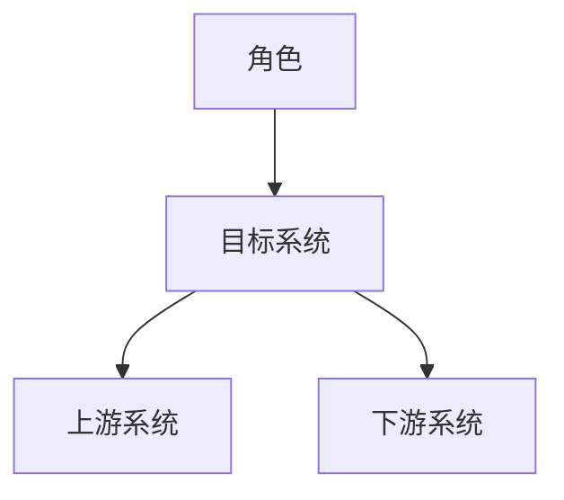
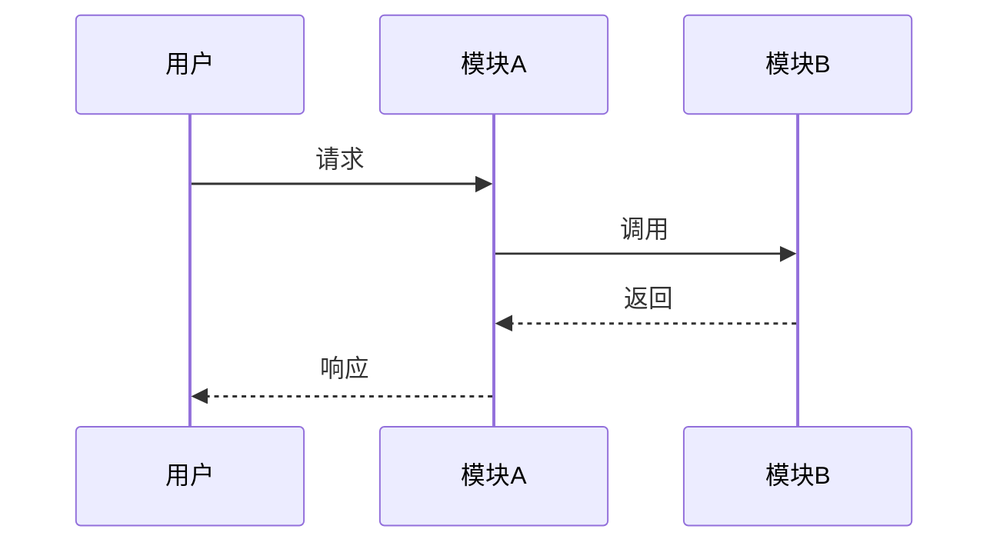

# 修订记录

| 版本 | 日期 | 作者 | 修订内容 | 依据 |
| --- | --- | --- | --- | --- |
| v0.1 | YYYY-MM-DD | Agent | 初始版本，形成高层设计结论。 | [SOURCE-01] |

# 文档概述

本文档面向产品、研发、测试、运维、安全、数据与业务干系人，说明「系统/功能名称」的高层设计结论、架构边界、核心决策、质量目标、风险与追踪关系。[SOURCE-01]

| 项目 | 内容 |
| --- | --- |
| 文档状态 | 草案/评审中/已批准 |
| 适用版本 | 版本或发布范围 |
| 系统范围 | 系统或子系统边界 |
| 主要读者 | 目标读者 |
| 证据范围 | 已引用的项目来源与方法论来源 |

# 背景与目标

## 背景

说明业务背景、用户问题、现有系统约束与本次设计的必要性。[BIZ-01][PRD-01]

## 设计目标

| 目标 | 成功标准 | 来源 |
| --- | --- | --- |
| 目标一 | 可验证标准 | [PRD-01] |

# 架构摘要

本设计采用「核心架构方案」以满足「关键目标」。该方案的核心是「模块/服务/数据/集成策略」，并在「可靠性/安全/性能/成本/运维」之间作出明确权衡。[TECH-01]

# 范围边界

| 类型 | 内容 | 来源 |
| --- | --- | --- |
| 范围内 | 设计覆盖内容 | [PRD-01] |
| 范围外 | 明确不覆盖内容 | [PRD-01] |
| 外部依赖 | 上下游系统、平台、组织或数据依赖 | [TECH-01] |

# 干系人与关注点

| 干系人 | 关注点 | HLD 响应 |
| --- | --- | --- |
| 产品负责人 | 范围、价值、里程碑 | 对应章节 |
| 研发团队 | 模块边界、接口、数据、风险 | 对应章节 |
| 运维团队 | 发布、监控、告警、回滚 | 对应章节 |
| 安全团队 | 身份、权限、合规、审计 | 对应章节 |

# 质量属性目标

| 质量属性 | 目标 | 度量方式 | 来源 |
| --- | --- | --- | --- |
| 可靠性 | 目标值或审查标准 | SLO/故障演练/恢复指标 | [OPS-01] |
| 性能 | 延迟、吞吐或容量目标 | 压测/监控指标 | [TECH-01] |
| 安全 | 权限、审计、加密、隔离要求 | 安全评审/日志审计 | [SEC-01] |

# 约束、假设与依赖

| 类型 | 内容 | 影响 | 来源 |
| --- | --- | --- | --- |
| 约束 | 已确认约束 | 对设计的影响 | [TECH-01] |
| 假设 | 尚未完全验证的前提 | 若不成立的影响 | [PRD-01] |
| 依赖 | 外部团队、系统或数据 | 交付或运行影响 | [TECH-01] |

# 架构视图

## 上下文视图

说明目标系统与用户、外部系统、数据源、运营平台之间的关系。[TECH-01]

## 模块/容器视图

| 模块 | 职责 | 主要接口 | 数据归属 | 来源 |
| --- | --- | --- | --- | --- |
| 模块 A | 职责说明 | API/Event/Job | 数据表或数据域 | [TECH-01] |

## 运行时视图

## 部署视图

说明环境、区域、网络、部署单元、伸缩方式与故障隔离策略。[OPS-01]

# 数据与接口设计

## 数据设计

| 数据对象 | 归属方 | 存储位置 | 一致性要求 | 保留周期 | 来源 |
| --- | --- | --- | --- | --- | --- |
| 数据对象 | 团队/模块 | 存储 | 强/最终一致 | 周期 | [DATA-01] |

## 接口设计

| 接口 | 提供方 | 调用方 | 协议 | 关键字段 | 错误处理 | 来源 |
| --- | --- | --- | --- | --- | --- | --- |
| 接口名称 | 模块 | 模块 | HTTP/Event/RPC | 字段 | 策略 | [TECH-01] |

# 安全、隐私与合规设计

| 控制项 | 设计结论 | 验证方式 | 来源 |
| --- | --- | --- | --- |
| 身份认证 | 认证机制 | 安全测试/配置审查 | [SEC-01] |
| 授权 | 权限模型 | 权限矩阵/审计 | [SEC-01] |
| 数据保护 | 加密、脱敏、保留 | 数据审查 | [SEC-01][DATA-01] |

# 可靠性、性能与容量设计

| 主题 | 设计结论 | 指标或验证方式 | 来源 |
| --- | --- | --- | --- |
| 可用性 | 目标与故障处理策略 | SLO/故障演练 | [OPS-01] |
| 性能 | 延迟与吞吐设计 | 压测指标 | [TECH-01] |
| 容量 | 容量估算依据 | 公式或模型 | [DATA-01] |

容量估算可使用：

$$
QPS_{peak}=DAU \times R_{avg} \times P_{peak} / T
$$

# 运维、可观测性与发布设计

| 能力 | 设计结论 | 责任方 | 来源 |
| --- | --- | --- | --- |
| 日志 | 日志范围与敏感字段策略 | 团队 | [OPS-01] |
| 指标 | 关键业务与技术指标 | 团队 | [OPS-01] |
| 告警 | 告警条件与等级 | 团队 | [OPS-01] |
| 发布与回滚 | 发布方式、灰度、回滚触发条件 | 团队 | [OPS-01] |

# 架构决策与权衡

| 决策 ID | 决策 | 背景 | 替代方案 | 理由 | 权衡与后果 | 来源 |
| --- | --- | --- | --- | --- | --- | --- |
| ADR-HLD-001 | 决策结论 | 背景 | 方案 A/方案 B | 选择理由 | 成本、风险、演进影响 | [TECH-01] |

# 风险、技术债与待确认事项

| 类型 | 内容 | 影响 | 缓解措施 | 责任方 | 状态 | 来源 |
| --- | --- | --- | --- | --- | --- | --- |
| 风险 | 风险说明 | 影响 | 措施 | 责任方 | 打开/关闭 | [TECH-01] |
| 待确认 | 未确认事实 | 影响 | 确认方式 | 责任方 | 打开 | [PRD-01] |

# 需求追踪矩阵

| 需求/目标 | 架构响应 | 相关决策 | 验证方式 | 来源 |
| --- | --- | --- | --- | --- |
| 需求编号 | 模块/视图/控制项 | ADR-HLD-001 | 测试/评审/监控 | [PRD-01] |

# 参考文献

| 标记 | 来源 | 说明 |
| --- | --- | --- |
| [SOURCE-01] | 来源名称或链接 | 项目事实来源 |
| [M01] | ISO/IEC/IEEE 42010 Architecture Descriptions | 方法论来源 |
