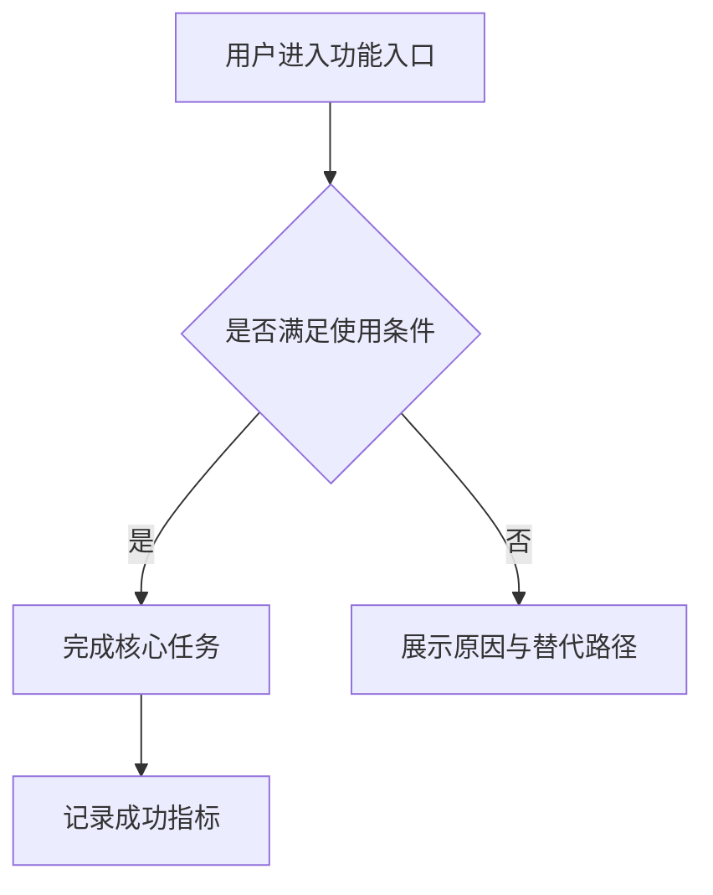

# <产品/功能名称> 产品需求文档（PRD）

## 修订记录

| 版本 | 日期 | 作者 | 修订内容 | 依据/审批 |
| --- | --- | --- | --- | --- |
| v0.1 | YYYY-MM-DD | <作者> | 初始版本。 | <来源或审批依据> |

## 文档摘要

| 项目 | 内容 |
| --- | --- |
| 文档目的 | <本 PRD 支持的决策或交付边界> |
| 目标读者 | <产品/设计/研发/测试/运营/安全/管理层等> |
| 适用版本 | <版本或发布阶段> |
| 当前状态 | <草案/评审中/已批准/已冻结> |

## 背景与问题

<用简洁书面语说明用户或业务问题，并标注来源。>

## 目标与成功指标

| ID | 目标 | 指标定义 | 当前基线 | 目标值 | 依据 |
| --- | --- | --- | --- | --- | --- |
| G-001 | <目标> | <指标口径> | <基线> | <目标> | [SOURCE-ID] |

```latex
\text{示例指标} = \frac{\text{达成目标的对象数}}{\text{进入统计口径的对象数}}
```

## 用户与使用场景

| 用户/角色 | 核心诉求 | 典型场景 | 当前痛点 | 依据 |
| --- | --- | --- | --- | --- |
| <角色> | <诉求> | <场景> | <痛点> | [SOURCE-ID] |

## 范围定义

| 类型 | 内容 | 说明 | 依据 |
| --- | --- | --- | --- |
| 范围内 | <必须交付内容> | <说明> | [SOURCE-ID] |
| 范围外 | <明确不做内容> | <说明> | [SOURCE-ID] |
| 假设 | <暂定前提> | <验证方式或失效影响> | [SOURCE-ID] |
| 约束 | <业务/技术/合规约束> | <说明> | [SOURCE-ID] |

## 用户旅程或业务流程



## 功能需求

| ID | 优先级 | 需求 | 说明 | 依据 | 验收标准 |
| --- | --- | --- | --- | --- | --- |
| FR-001 | P0 | <需求结论> | <必要说明> | [SOURCE-ID] | AC-001 |

## 非功能需求与约束

| ID | 类别 | 要求 | 验证方式 | 依据 |
| --- | --- | --- | --- | --- |
| NFR-001 | 性能 | <性能要求> | <测试或监控方式> | [SOURCE-ID] |

## 数据、埋点与度量方案

| ID | 事件/指标 | 定义 | 属性/维度 | 看板/负责人 | 决策阈值 | 依据 |
| --- | --- | --- | --- | --- | --- | --- |
| MET-001 | <指标> | <口径> | <维度> | <看板/负责人> | <阈值> | [SOURCE-ID] |

## 验收标准

| ID | 对应需求 | 验收标准 | 验证方式 | 依据 |
| --- | --- | --- | --- | --- |
| AC-001 | FR-001 | Given <前置条件>, When <动作>, Then <可观察结果>. | <测试/评审/监控> | [SOURCE-ID] |

## 发布、灰度与回滚

| 阶段 | 范围 | 进入条件 | 监控项 | 回滚条件 | 负责人 |
| --- | --- | --- | --- | --- | --- |
| 内部验证 | <范围> | <条件> | <监控项> | <触发条件> | <负责人> |

## 依赖、风险与开放问题

| 类型 | ID | 内容 | 影响 | 负责人 | 截止日期 | 状态 | 依据 |
| --- | --- | --- | --- | --- | --- | --- | --- |
| 风险 | RISK-001 | <风险> | <影响> | <负责人> | <日期> | <状态> | [SOURCE-ID] |
| 开放问题 | OQ-001 | <问题> | <影响> | <负责人> | <日期> | <状态> | [SOURCE-ID] |

## 需求追踪矩阵

| 来源 | 目标 | 需求 | 验收标准 | 指标/监控 |
| --- | --- | --- | --- | --- |
| [SOURCE-ID] | G-001 | FR-001 | AC-001 | MET-001 |

## 参考文献

| 来源ID | 名称 | 链接/位置 | 访问或引用日期 |
| --- | --- | --- | --- |
| [SOURCE-ID] | <来源名称> | <URL 或文件路径> | YYYY-MM-DD |
