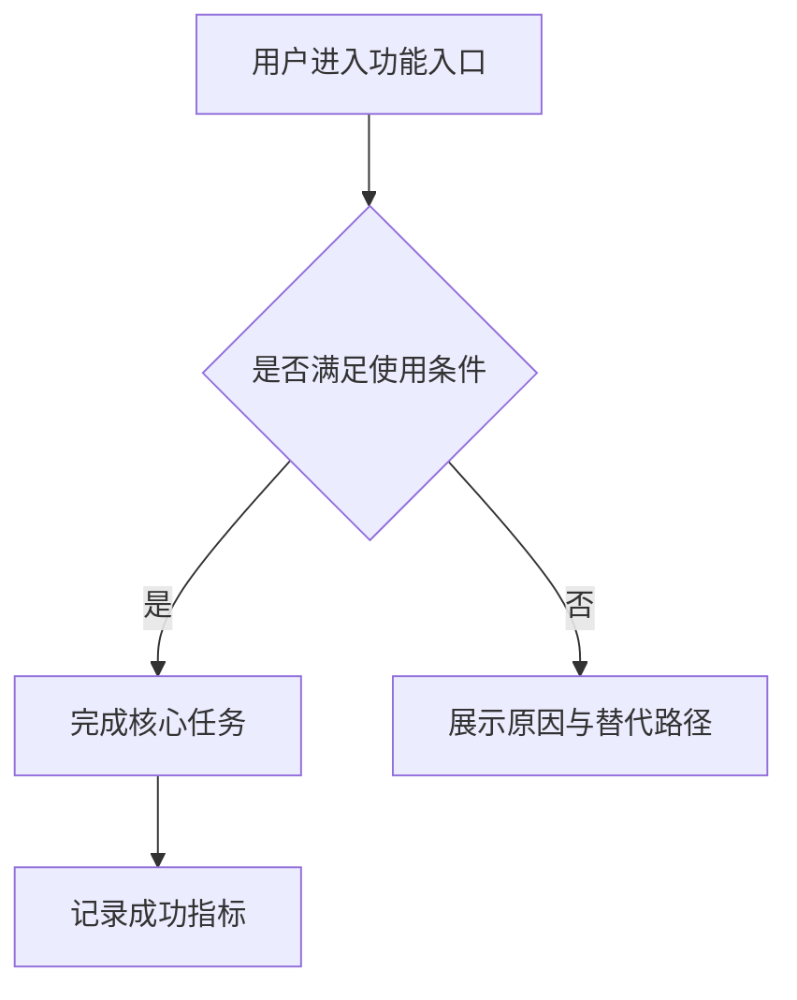
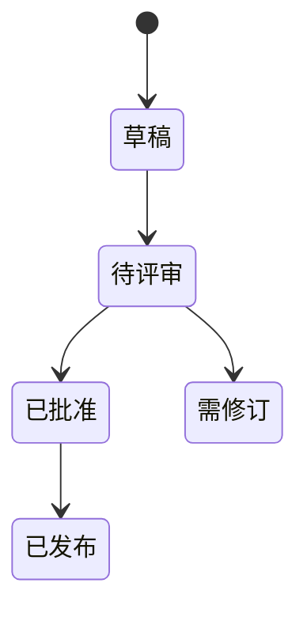

# PRD Methodology Reference

This reference distills external PRD and requirements-writing guidance into reusable rules for writing software product PRDs. Use these sources to justify document structure and quality standards. Do not use them as evidence for the user's product facts.

## Source IDs

| ID | Source | Relevant Methodology |
| --- | --- | --- |
| M01 | Atlassian, "What is a Product Requirements Document (PRD)?" https://www.atlassian.com/agile/product-management/requirements | PRD as team alignment, context, goals, assumptions, user stories, design, open questions, and scope. |
| M02 | Atlassian Confluence, "Product Requirements Document Template" https://www.atlassian.com/software/confluence/templates/product-requirements | Template sections for participants, status, target release, goals, assumptions, requirements, user stories, importance, and notes. |
| M03 | Aha!, "PRD Templates: What To Include for Success" https://www.aha.io/roadmapping/guide/requirements-management/what-is-a-good-product-requirements-document-template | Clear actionable requirements, strategic context, users, goals, features, dependencies, timeline, and release information. |
| M04 | Productboard, "Product Requirements Document" https://www.productboard.com/glossary/product-requirements-document/ | Good PRDs identify the outcome, target users, product view, releases, and stay concise enough for the whole team. |
| M05 | Airtable, "What is a Product Requirements Document?" https://www.airtable.com/articles/product-requirements-document | PRD as source of truth for purpose, features, functionality, team roles, timeline, milestones, and supporting docs. |
| M06 | Product School, "The Only PRD Template You Need" https://productschool.com/blog/product-strategy/product-template-requirements-document-prd | PRD communicates what is built, for whom, why it benefits users, and how business and technical teams align. |
| M07 | Perforce, "How to Write a PRD" https://www.perforce.com/blog/alm/how-write-product-requirements-document-prd | PRD should manage requirements rigorously, avoid lost feedback, support traceability, and align distributed teams. |
| M08 | Nuclino, "How to Write a Product Requirements Document" https://www.nuclino.com/articles/product-requirements-document | Be precise about what must be built while leaving implementation choices to the development team. |
| M09 | Roman Pichler, "The GO Product Roadmap" https://www.romanpichler.com/blog/goal-oriented-agile-product-roadmap | Goal-oriented planning supports alignment and avoids feature-only roadmaps that change too easily. |
| M10 | Roman Pichler, "Roman's Product Strategy Model" https://www.romanpichler.com/blog/my-product-strategy-model/amp/ | Product strategy connects vision, target group, needs, product, business goals, roadmap, and backlog artifacts. |
| M11 | Product Blueprint, "PRD Essential Guide" https://product-blueprint.com/prd-product-requirements-document/ | Minimum PRD set: problem, outcomes, users, use cases, scope, acceptance criteria, guardrails, analytics, rollout, and rollback. |
| M12 | Pendo, "Product Requirements Document Template" https://www.pendo.io/product-led/artifacts/product-requirements-document-prd-template/ | PRD as a living guide for features, functionality, purpose, go-to-market, testing, release, and iteration. |
| M13 | Lucid, "Product Requirements Document Template" https://lucid.co/templates/product-requirements-document-prd | Visual templates can clarify requirements and create shared understanding. |
| M14 | Behutiye et al., "Non-functional Requirements Documentation in Agile Software Development" https://arxiv.org/abs/1711.08894 | Non-functional requirements often need explicit documentation through epics, features, stories, acceptance criteria, definition of done, and backlog artifacts. |
| M15 | Knauss and Boustani, "A Quality Framework for Agile Requirements" https://arxiv.org/abs/1406.4692 | Agile requirements quality depends on clarity, completeness appropriate to timing, and ambiguity management. |
| M16 | BSpec, "PRD: Product Requirements Document" https://bspec.dev/docs/types/PRD | PRD bridges customer needs with technical implementation and can be structured for machine-readable traceability. |

## Distilled Writing Principles

| Principle | Rule | Source IDs |
| --- | --- | --- |
| Outcome before feature | State the user/business problem and measurable outcome before listing features. | M04, M09, M10, M11 |
| Human alignment | Write so product, design, engineering, QA, operations, and business stakeholders can make the same decision from the same document. | M01, M03, M05, M06 |
| Concise sufficiency | Keep the PRD long enough to align the team and short enough to be read and maintained. | M04, M08, M11 |
| Evidence-backed facts | Distinguish product facts from assumptions, open questions, and methodology guidance. | M07, M15, M16 |
| Testable requirements | Write requirements and acceptance criteria that can be verified by review, test, analytics, or release checks. | M02, M07, M11, M14 |
| Explicit scope boundary | Include in-scope, out-of-scope, non-goals, dependencies, and constraints to control scope creep. | M01, M03, M11 |
| User-centered scenarios | Identify target users, user needs, use cases, journeys, and edge cases. | M01, M04, M05, M10 |
| Non-functional coverage | Include performance, security, privacy, accessibility, reliability, compatibility, observability, compliance, and maintainability when relevant. | M11, M14 |
| Measurement plan | Define primary metrics, guardrail metrics, event tracking, dashboards, owners, and decision thresholds. | M03, M11, M12 |
| Release safety | Include rollout, feature flags or phased release, communication, support readiness, rollback triggers, and cleanup. | M11, M12 |
| Traceability | Link objectives, requirements, acceptance criteria, metrics, risks, and source evidence. | M07, M15, M16 |
| Appropriate visuals | Use diagrams, tables, and formulas to clarify complex flows, requirements, dependencies, or measurement. | M13, M16 |

## Recommended PRD Content Model

| Module | Purpose | Typical Expression |
| --- | --- | --- |
| Revision history | Records document updates honestly. | Table |
| Executive summary | Tells readers what decision or delivery the PRD supports. | Short prose |
| Background and problem | Explains why the product change matters. | Prose plus evidence markers |
| Goals and success metrics | Defines measurable outcomes and guardrails. | Table plus formulas |
| Users and scenarios | Clarifies who benefits and in which situations. | Persona table, JTBD, journey |
| Scope | Defines in-scope, out-of-scope, assumptions, and constraints. | Table |
| User/business flow | Makes workflow, state, or dependency visible. | Mermaid |
| Requirements | Defines functional and non-functional requirements. | Prioritized table |
| Analytics | Specifies events, properties, metrics, dashboards, and owners. | Table |
| Acceptance | Defines pass/fail criteria. | Given/When/Then table |
| Rollout | Defines release plan, support, monitoring, rollback. | Table |
| Risks and open questions | Records uncertainty and decisions needed. | Table |
| Traceability | Links sources to requirements and acceptance. | Matrix |
| References | Lists all sources cited. | Numbered or tabular list |

## Measurement Formula Patterns

Use formulas only when they make the metric logic clearer:

```latex
\text{转化率} = \frac{\text{完成目标动作的用户数}}{\text{进入目标漏斗的用户数}}
```

```latex
\text{预期增量} = \text{覆盖用户数} \times \text{基线率} \times \text{预期提升率} \times \text{证据置信度}
```

## Mermaid Patterns

Use simple Mermaid diagrams for user flows:



Use state diagrams for lifecycle logic:


