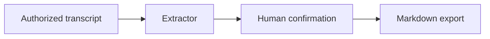

# Meeting Action Extractor High-Level Design

## Revision History

| Version | Date | Change | Author |
| --- | --- | --- | --- |
| v1.0 | 2026-05-27 | Ready HLD document rendered from `contract-envelope.json` and `high-level-design.json`. | Agent |

## Scope And Goals

The Phase 1 design extracts evidence-backed meeting action items from authorized transcript input and exports confirmed items as Markdown. The design is bounded by the current contract and covers `REQ-001`, `AC-001`, `VER-001`, `IN-001`, `EXE-001`, `OUT-001`, `STOP-001`, and `DONE-001`.

## Architecture Overview

The architecture separates transcript input, extraction, human confirmation, and Markdown export. External task-system creation remains outside Phase 1 through `OOS-001` and `STOP-001`.

## Control Flow

The runtime flow accepts authorized transcript input, extracts candidates, requires human confirmation, exports only confirmed Markdown, and stops when authorization is absent or external task creation is requested. This implements `EXE-001`, `STOP-001`, and `DONE-001`.

## Data Flow

Transcript text from `IN-001` is transformed into action-item candidates, then into confirmed Markdown output under `OUT-001`. Unconfirmed extraction state is not an accepted deliverable.

## Data Objects

| Object | Fields | Lifecycle |
| --- | --- | --- |
| `ActionItemCandidate` | `action`, `owner`, `due_date`, `source_evidence`, `confirmation_status` | Created from authorized transcript text, reviewed, and exported only after confirmation. |

## Interface Contracts

| Interface | Provider | Consumer | Inputs | Outputs |
| --- | --- | --- | --- | --- |
| Transcript input | Reviewer | Extractor | authorized transcript text | reviewable action candidates |
| Markdown export | Extractor | Human reviewer | confirmed candidates | Markdown action-item list |

Source-backed interface precision:

| Interface | Source Evidence | Exact Invocation Boundary |
| --- | --- | --- |
| Transcript input interface | Original user idea and Stage 1 source. [SRC-001] | Provide one authorized transcript text input and reject missing authorization. |
| Markdown export interface | Original user idea and Stage 1 source. [SRC-001] | Export only confirmed `ActionItemCandidate` records to Markdown; do not create external tasks. |

## State Model

The state model moves from authorized input received to confirmed for export. Missing authorization or external task creation requests stop the flow under `STOP-001`.

## Technical Decisions

The design keeps Phase 1 export limited to Markdown and requires source evidence for every exported item. These decisions implement `REQ-001`, `AC-001`, `EXE-001`, `OUT-001`, and `DONE-001`.

## Implementation Design

The extractor must preserve source evidence, block unconfirmed candidates from export, and guard external task-system creation through `STOP-001`. The implementation should treat confirmation status as required state before writing Markdown.

## Real Acceptance Plan

Real acceptance runs in the confirmed local Phase 1 extractor runtime from `SRC-003`, using the authorized transcript file from `SRC-004`, with acceptance ownership recorded by `SRC-005`. It verifies extraction, confirmation, Markdown export, and stop behavior with no substitute inputs.

Executable acceptance design:

| Acceptance Element | Concrete Value |
| --- | --- |
| Acceptance Command | `C:/tmp/spec-intake-acceptance/meeting-action-extractor/bin/extract-actions --input C:/tmp/spec-intake-acceptance/data/authorized-meeting-transcript-001.txt --output C:/tmp/spec-intake-acceptance/output/actions.md --evidence-dir C:/tmp/spec-intake-acceptance/evidence` |
| Preconditions | Real extractor runtime exists, authorized transcript exists, and external task-system connectors are disabled. [SRC-003][SRC-004] |
| Expected Artifact Paths | `C:/tmp/spec-intake-acceptance/output/actions.md`, `C:/tmp/spec-intake-acceptance/evidence/extraction-run.json`, `C:/tmp/spec-intake-acceptance/evidence/reviewer-approval.md`, `C:/tmp/spec-intake-acceptance/evidence/stop-condition-external-task.json`. |
| Mechanical Checks | Verify Markdown contains only confirmed items, evidence maps to each exported action, reviewer approval is recorded, and external task creation is refused. [VER-001][OUT-001] |
| Failure Criteria | Fail if export occurs before confirmation, source evidence is missing, external task creation succeeds, or required evidence is absent. [STOP-001][DONE-001] |

## Risks And Guardrails

The main risk is over-exporting unconfirmed or unsupported items. The guardrail is evidence-required extraction plus human confirmation before Markdown output.

## References

- `contract-envelope.json`
- `high-level-design.json`
- `REQ-001`, `AC-001`, `VER-001`, `IN-001`, `EXE-001`, `OUT-001`, `STOP-001`, `DONE-001`, `OOS-001`
- `SRC-003`, `SRC-004`, `SRC-005`
