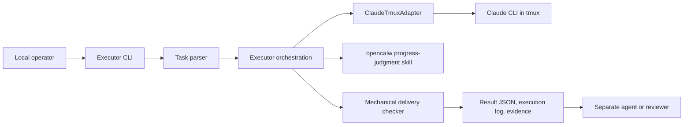
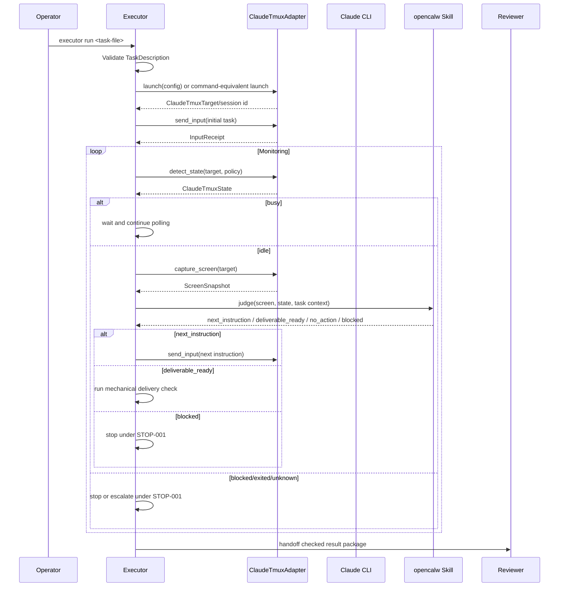
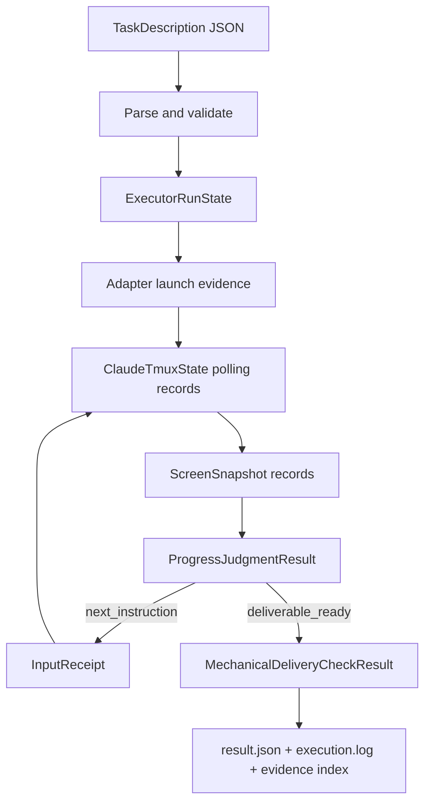
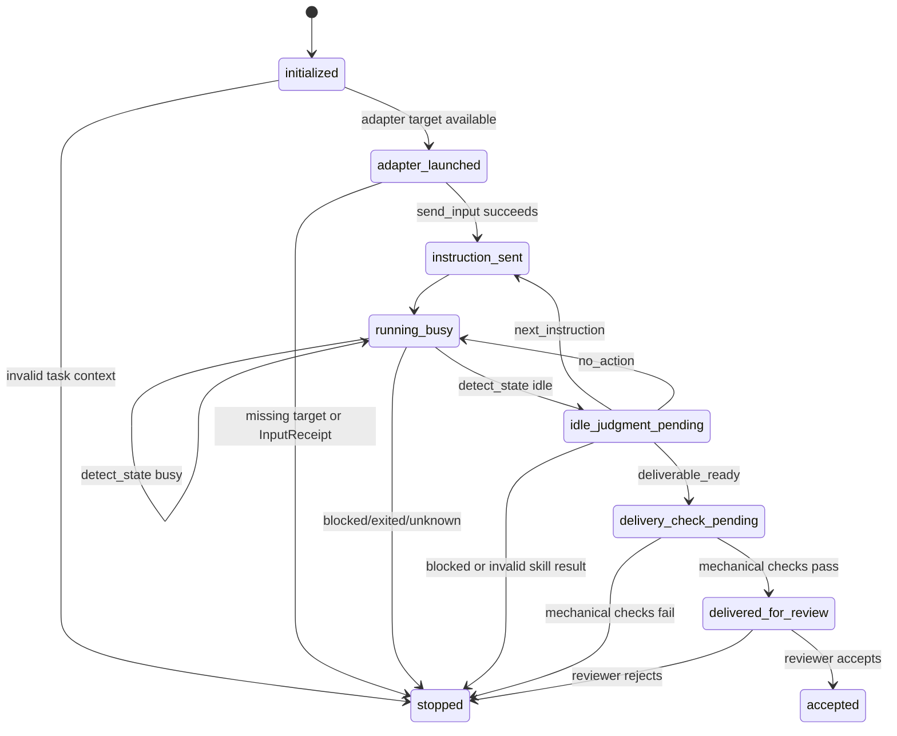

# Executor 高层设计文档

## Revision History

| Version | Date | Change | Author |
| --- | --- | --- | --- |
| v1.0 | 2026-05-27 | 形成 Executor MVP 高层设计，明确控制流、数据流、接口、数据对象、技术决策和真实验收方案。 | Agent |

## Scope And Goals

本设计覆盖 `PHASE-001` 的 Executor MVP。Executor 是一个本地 CLI 编排程序，入口为 `executor run <task-file>`；它读取任务描述中的工作环境、权限、技能配置和交付标准，通过 `ClaudeTmuxAdapter` 启动、控制和监控 Claude CLI，并在 Claude 进入空闲状态时通过 `opencalw` 调用独立的进展判断技能。[REQ-001][REQ-002][REQ-003][REQ-004][REQ-006][REQ-007]

Executor 的交付目标不是自证任务语义完成，而是产出结构化 JSON、执行日志、adapter 证据、进展判断证据和机械性交付检查结果，随后交给独立 agent 或 reviewer 做最终验收。[REQ-005][REQ-008][OUT-001][DONE-001]

不在本阶段范围内的内容包括：绕过 `ClaudeTmuxAdapter` 直接控制 Claude CLI、把语义进展判断放进 `ClaudeTmuxAdapter`、未经过机械性交付检查直接交付、远程/托管执行、额外外部服务、后台调度器、非本地调用模式。[TECH-001][TECH-002][BAR-001]

## Architecture Overview

Executor 由五个核心边界组成：CLI 与任务解析、编排与状态机、`ClaudeTmuxAdapter` 适配端口、`opencalw` 进展判断技能、机械性交付检查与输出写入。`ClaudeTmuxAdapter` 只负责机械能力：启动或定位 Claude CLI、发送输入、捕捉屏幕、检测状态和读取输出；它不负责判断任务是否完成。[MOD-001][MOD-002][MOD-003][TECH-001][TECH-002][SRC-005][SRC-006]

## Control Flow

控制流分为五个环节。第一，Executor 从本地 CLI 接收任务文件并校验 `TaskDescription`；任务文件缺失、环境/权限/技能配置不完整时必须停止。[IN-001][DCT-001][STOP-001]

第二，Executor 通过 `ClaudeTmuxAdapter` 的 launch 能力或命令等价能力启动 Claude CLI，并记录 `ClaudeTmuxTarget` 或 session id。没有可寻址目标时不得继续执行。[REQ-003][REQ-006][TECH-001]

第三，Executor 使用 `send_input` 发送初始任务指令，并记录 `InputReceipt`。之后进入周期性监控循环，调用 `detect_state` 获取 `ClaudeTmuxState`。`busy` 继续等待，`idle` 进入屏幕捕获与进展判断，`blocked`、`exited` 或证据不足的 `unknown` 进入停止或显式恢复路径。[EXE-001][VER-001][STOP-001]

第四，当状态为 `idle`，Executor 必须先调用 `capture_screen` 取得 `ScreenSnapshot`，再通过 `opencalw` 调用 `executor-progress-judgment` 技能。技能输出只能是 `next_instruction`、`deliverable_ready`、`no_action` 或 `blocked`。[REQ-007][AC-007][MOD-003]

第五，当技能返回 `deliverable_ready`，Executor 执行机械性交付检查。检查通过后，Executor 交付结果包给独立 agent 或 reviewer；检查失败或 reviewer 拒绝时按 `STOP-001` 处理。[REQ-008][AC-008][DONE-001]

## Data Flow

输入数据是任务文件，字段包括工作环境、权限、技能配置、adapter 配置、交付标准和验收输出路径。[REQ-002][IN-001][DCT-001]

运行过程中产生四类证据数据：adapter 证据、进展判断证据、机械性交付检查证据、最终输出证据。adapter 证据覆盖 `ClaudeTmuxTarget`、`ClaudeTmuxState`、`ScreenSnapshot`、`InputReceipt` 和必要时的 `OutputWindow`；进展判断证据覆盖技能输入、技能输出和判断理由。[DATA-001][OUT-001][SRC-005]

最终输出必须包含结构化 JSON、执行日志、adapter evidence、progress-judgment evidence 和 delivery-check 结果。所有输出仅证明“交付包经过机械检查”，不证明任务语义完成。[REQ-005][REQ-008][DONE-001]

## Data Objects

| Object | Required Fields | Purpose | Lifecycle |
| --- | --- | --- | --- |
| `TaskDescription` | `task_id`, `description`, `work_environment`, `permissions`, `skill_configuration`, `delivery_standard` | 表示 CLI 接收的任务定义。 | CLI 启动时加载，adapter 启动前校验，结果中记录摘要。[IN-001][DCT-001] |
| `ExecutorRunState` | `run_id`, `task_ref`, `current_status`, `evidence_index` | 跟踪一次 executor 运行的状态和证据索引。 | 初始化后贯穿监控循环，最终写入结果。[FLOW-001][DATA-001] |
| `AdapterEvidenceRecord` | `record_id`, `adapter_method`, `observed_at`, `payload_summary`, `evidence_path` | 记录 adapter 每次 launch、state、screen、input、output 操作。 | 每次 adapter 调用后追加。[REQ-006][MOD-002] |
| `ProgressJudgmentResult` | `decision`, `reason`, `screen_evidence_ref`, `skill_evidence_path` | 记录 `opencalw` 技能对 idle 屏幕的主观判断。 | 每次 idle 判断后生成，驱动下一步分支。[REQ-007][TECH-002] |
| `MechanicalDeliveryCheckResult` | `result_json_present`, `execution_log_present`, `adapter_evidence_present`, `progress_evidence_present`, `stop_done_consistency`, `passed` | 记录交付前机械检查。 | `deliverable_ready` 后生成，通过后才能 handoff。[REQ-008][AC-008] |

## Interface Contracts

| Interface | Provider | Consumer | Invocation | Inputs | Outputs | Error Semantics |
| --- | --- | --- | --- | --- | --- | --- |
| Executor CLI | Executor | Local operator | `executor run <task-file>` | 符合 `TaskDescription` 的任务文件 | `result.json`, `execution.log`, evidence directories, `delivery-check.json` | 任务文件或上下文无效时结构化失败并停止。[REQ-004][STOP-001] |
| ClaudeTmuxAdapter control | ClaudeTmuxAdapter | Executor | launch, `detect_state`, `capture_screen`, `send_input`, optional `read_output` | launch config, `ClaudeTmuxTarget`, `DetectionPolicy`, instruction content | `ClaudeTmuxTarget`, `ClaudeTmuxState`, `ScreenSnapshot`, `InputReceipt`, `OutputWindow` | adapter 失败只能成为停止证据，不能被解释为成功。[REQ-006][TECH-001] |
| opencalw progress skill | `executor-progress-judgment` | Executor | idle 后调用 | `ScreenSnapshot.text`, adapter state, task context, prior decisions | `next_instruction`, `deliverable_ready`, `no_action`, `blocked` | 技能失败、输出非法或 blocked 时按 `STOP-001` 停止或升级。[REQ-007][TECH-002] |
| Reviewer handoff | Executor | Separate agent or reviewer | 机械检查通过后提交结果包 | checked output package | semantic acceptance or rejection | Executor 不得替 reviewer 宣称语义完成。[REQ-005][DONE-001] |

Source-backed interface precision:

| Interface | Source Evidence | Exact Invocation Boundary |
| --- | --- | --- |
| Executor CLI | User idea and confirmed Stage 1 answers. [SRC-001][SRC-002] | `executor run <task-file>` accepts exactly one task file and returns structured output or structured failure. |
| ClaudeTmuxAdapter control | `README.md` and adapter Agent PRD in `C:/Users/54256213/Documents/github/claude-tmux-adapter`. [SRC-005][SRC-006] | Call launch capability, then `detect_state(target, DetectionPolicy)`, `capture_screen(target, lines)`, `send_input(target, content, submit)`, and `read_output(target, ReadWindow)` according to the adapter interface table. |
| opencalw progress skill | User-confirmed executor boundary. [SRC-001][SRC-002] | Invoke `executor-progress-judgment` only after `detect_state` reports idle and `capture_screen` returns a current `ScreenSnapshot`. |
| Reviewer handoff | Stage 3 authorization and acceptance ownership. [SRC-007] | Handoff only after `delivery-check.json` passes; reviewer acceptance remains separate from executor mechanical success. |

## State Model

状态模型的关键约束是：adapter 状态只能描述机械可观察状态，不能直接推出任务完成；`deliverable_ready` 只能触发机械性交付检查，不能跳过 reviewer 或 separate agent 的语义验收。[TECH-001][TECH-002][DONE-001]

## Technical Decisions

| Decision | Rationale | Implementation Notes |
| --- | --- | --- |
| MVP 仅提供本地 CLI | `REQ-004` 和 `SRC-002` 确认第一阶段只需要本地 CLI。 | `executor run <task-file>` 是唯一授权入口；其他入口需要更新需求表。[REQ-004][BAR-001] |
| Claude CLI 控制全部经过 `ClaudeTmuxAdapter` | 用户要求复用已成型 adapter，adapter 文档提供 launch/capture/status/input/output 机械接口。 | 建立 Executor adapter port，记录所有 adapter 调用的证据。[REQ-003][REQ-006][SRC-005][SRC-006] |
| 主观进展判断独立为 `opencalw` 技能 | `ClaudeTmuxAdapter` 必须保持机械状态判断，不能承载语义判断。 | idle 后先 `capture_screen`，再调用技能；技能输出必须枚举化。[REQ-007][TECH-002] |
| 交付前必须做机械检查 | 防止 Claude 看似完成或技能判断完成时直接交付。 | 检查 JSON、日志、adapter 证据、progress 证据和 stop/done 一致性。[REQ-008][AC-008] |

## Implementation Design

Executor 实现应拆成五个实现关注点，而不是拆成任务计划。

第一，CLI 与任务解析模块读取任务文件，将其转换为 `TaskDescription`，校验工作环境、权限、技能配置、adapter 配置和交付标准。任何缺失都直接形成结构化失败。[REQ-001][REQ-002][IN-001][STOP-001]

第二，`ClaudeTmuxAdapter` port 只包装文档化 adapter 能力：launch 或等价启动、`detect_state`、`capture_screen`、`send_input`、必要时 `read_output`。每次调用都必须返回 typed value 或 structured failure，并落盘证据。[REQ-006][SRC-005][SRC-006]

第三，monitoring loop 是确定性的状态轮询。`busy` 继续等待；`idle` 进入屏幕捕捉和技能判断；`blocked/exited/unknown` 没有足够证据时停止。[EXE-001][VER-001][STOP-001]

第四，`executor-progress-judgment` 技能由 `opencalw` 调用，输入为屏幕文本、adapter 状态、任务上下文、历史判断和交付标准，输出只能是四类枚举结果。[REQ-007][MOD-003]

第五，delivery checker 在 `deliverable_ready` 后运行。它不做语义判断，只验证输出和证据是否完整，并写出 `delivery-check.json`。[REQ-008][DONE-001]

## Real Acceptance Plan

| Item | Concrete Value |
| --- | --- |
| Environment | `C:/Users/54256213/Documents/github/spec-skills/skills/spec-intake/tests/live-runs/2026-05-27/executor-minimal-stage2`，并引用 `C:/Users/54256213/Documents/github/claude-tmux-adapter` 中的 adapter 文档与实现。[SRC-008][SRC-005][SRC-006] |
| Real Data | `C:/Users/54256213/Documents/github/spec-skills/skills/spec-intake/tests/live-runs/2026-05-27/executor-minimal-stage2/acceptance/executor-real-task.json`。[SRC-009] |
| Acceptance Owner | 授权第三阶段执行并验收本 HLD 包的 human reviewer。[SRC-007] |
| Substitute Policy | 不允许 mock、stub、fake、simulated、synthetic 验收输入；所有验收必须使用上述真实路径和真实任务文件。 |

验收步骤如下：

1. 使用真实任务文件运行 `executor run <task-file>`。[REQ-001][REQ-004]
2. 验证任务上下文解析出工作环境、权限、技能配置、adapter 配置和交付标准。[REQ-002][IN-001]
3. 验证 `ClaudeTmuxAdapter` 启动或等价启动返回 `ClaudeTmuxTarget` 或 session id，并保留 launch metadata。[REQ-006][SRC-006]
4. 验证初始任务通过 `send_input` 发送，并记录 `InputReceipt`。[REQ-006][SRC-005]
5. 验证周期性 `detect_state` 记录 `ClaudeTmuxState`，`busy` 时继续等待。[AC-006]
6. 验证 `idle` 时调用 `capture_screen`，记录 `ScreenSnapshot`，并通过 `opencalw` 调用进展判断技能。[AC-007]
7. 验证 `next_instruction` 会通过 `send_input` 执行，`deliverable_ready` 会触发机械性交付检查。[REQ-007][REQ-008]
8. 验证机械性交付检查覆盖 `result.json`、`execution.log`、adapter evidence、progress evidence 和 stop/done 一致性。[AC-008][OUT-001][DONE-001]

验收证据包括任务文件路径与内容 hash、CLI invocation 记录、`ClaudeTmuxTarget` 或 session id、`ClaudeTmuxState` 轮询记录、`ScreenSnapshot`、`InputReceipt`、`opencalw` 技能请求/响应、`delivery-check.json`、`result.json`、`execution.log` 和 reviewer acceptance record。[VER-001][OUT-001]

Executable acceptance design:

| Acceptance Element | Concrete Value |
| --- | --- |
| Acceptance Command | `executor run C:/Users/54256213/Documents/github/spec-skills/skills/spec-intake/tests/live-runs/2026-05-27/executor-minimal-stage2/acceptance/executor-real-task.json` |
| Preconditions | Real executor CLI is callable; Claude CLI and tmux-compatible session control are available; `ClaudeTmuxAdapter` is available from `C:/Users/54256213/Documents/github/claude-tmux-adapter`; `executor-progress-judgment` is callable through `opencalw`. [SRC-005][SRC-006][SRC-008] |
| Expected Artifact Paths | `result.json`, `execution.log`, `delivery-check.json`, `adapter-evidence/`, `progress-judgment-evidence/`, `reviewer-acceptance-record.md`. |
| Mechanical Checks | Validate result/log presence, adapter target/state/screen/input evidence, progress-judgment request/response evidence, delivery-check pass result, and stop/done consistency. [VER-001][OUT-001] |
| Failure Criteria | Fail if adapter evidence is missing, idle judgment lacks a `ScreenSnapshot` plus opencalw response, `deliverable_ready` skips delivery checks, executor claims semantic completion without reviewer acceptance, or any required artifact is absent. [STOP-001][DONE-001] |

## Risks And Guardrails

| Risk | Guardrail |
| --- | --- |
| 把 adapter idle 状态误当作任务完成 | adapter 只提供机械证据；语义判断由 `opencalw` 技能和 reviewer 分层承担。[TECH-001][TECH-002] |
| 进展判断技能输出不可执行或越权 | 技能输出必须是枚举结果；`next_instruction` 必须通过权限边界和 `send_input` 执行。[REQ-007][STOP-001] |
| 交付包缺证据仍被交付 | delivery checker 必须检查 JSON、日志、adapter evidence、progress evidence 和 stop/done 一致性。[REQ-008][AC-008] |
| HLD 引入未授权入口、外部服务或输出格式 | 任何新增入口、服务、schema 或持久化状态都必须先更新需求表。[BAR-001] |

## References

- `contract-envelope.json`：Stage 1/2/3 的唯一事实来源。
- `agent-prd.md`：execution-ready Agent PRD。
- `human-prd.md`：已批准的人类评审简报。
- `acceptance/executor-real-task.json`：真实验收任务输入。[SRC-009]
- `C:/Users/54256213/Documents/github/claude-tmux-adapter/README.md`：`ClaudeTmuxAdapter` 方法与数据对象来源。[SRC-005]
- `C:/Users/54256213/Documents/github/claude-tmux-adapter/docs/agent-prd.md`：adapter launch/capture/status/input/termination 命令合同来源。[SRC-006]
- Current design refs: [REQ-001][REQ-002][REQ-003][REQ-004][REQ-005][REQ-006][REQ-007][REQ-008][AC-001][AC-002][AC-003][AC-004][AC-005][AC-006][AC-007][AC-008][IN-001][DCT-001][FLOW-001][DATA-001][MOD-001][MOD-002][MOD-003][TECH-001][TECH-002][EXE-001][VER-001][OUT-001][STOP-001][DONE-001].
