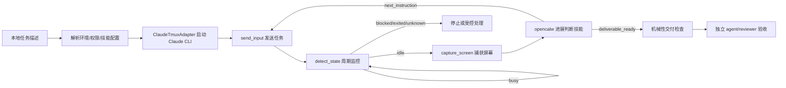

# Executor Human PRD

## 修订记录

| 版本 | 日期 | 修订说明 | 修订人 |
| --- | --- | --- | --- |
| v1.2 | 2026-05-27 | 明确 `ClaudeTmuxAdapter` 真实接口、周期监控、空闲态判断技能和交付前机械检查。 | Agent |
| v1.1 | 2026-05-27 | 根据评审意见补充 `ClaudeTmuxAdapter` 执行与监控要求，明确状态捕获、屏幕内容捕获、执行证据和验收边界。 | Agent |
| v1.0 | 2026-05-27 | 形成面向人工评审的正式简报，补充目标、范围、方案、验收、路线图与出处。 | Agent |

## 产品目标

Executor 的目标是提供一个本地命令行执行器，使用户能够通过任务描述驱动 Claude CLI 完成工作。任务描述承载工作环境、权限、技能配置和执行约束；Executor 复用已成型的 `ClaudeTmuxAdapter`，通过真实 adapter 能力启动 Claude CLI、观测状态、捕获屏幕、发送指令并保存证据。[CORE-001][REQ-001][REQ-002][REQ-003][REQ-006][SRC-001][SRC-005][SRC-006]

Executor 不把 adapter 的机械状态当作任务完成结论。Claude 空闲时，Executor 将当前屏幕交给通过 `opencalw` 调用的进展判断技能，由该技能判断是否需要下一步指令；可以交付时，Executor 先完成机械性交付检查，再交给独立 agent 或 reviewer 做最终验收。[REQ-005][REQ-007][REQ-008][DONE-001][SRC-004]

## 建设范围

| 类别 | 结论 | 依据 |
| --- | --- | --- |
| 当前范围 | 提供本地 CLI 入口，例如 `executor run <task-file>`；读取任务描述；通过 `ClaudeTmuxAdapter` 启动 Claude CLI、检测状态、捕获屏幕、发送任务与后续指令；通过 `opencalw` 进展判断技能处理空闲态屏幕；输出结构化 JSON、执行日志和可审计证据。 | [REQ-001][REQ-003][REQ-004][REQ-006][REQ-007][OUT-001][SRC-002][SRC-004] |
| 交付边界 | Claude 显示空闲或任务似乎结束时，Executor 必须先执行机械性交付检查；检查通过后才能进入独立 agent/reviewer 验收。 | [REQ-005][REQ-008][AC-008][DONE-001] |
| 明确不做 | MVP 不包含 library/API 入口，不直接控制 Claude CLI 进程，不把语义判断放入 `ClaudeTmuxAdapter`，不把 adapter 状态、屏幕状态或判断技能结果单独作为完成结论。 | [REQ-004][REQ-006][REQ-007][TECH-001][TECH-002][BAR-001] |

## 实现方案

Executor 采用“本地任务输入、Adapter 机械执行、空闲态技能判断、机械交付检查、独立验收”的闭环。Adapter 只负责可观测、可回放的机械交互；主观进展判断由专门技能承担；交付可信度来自机械检查和最终人工/agent 验收。[EXE-001][MOD-002][MOD-003][TECH-001][TECH-002][SRC-005]

| 步骤 | 实现要求 | 关键证据 |
| --- | --- | --- |
| 启动会话 | 通过 `ClaudeTmuxAdapter` 的启动能力或等价命令启动 Claude CLI，并保存 `ClaudeTmuxTarget` 或 session id。 | 启动元数据、目标定位信息。[REQ-006][SRC-006] |
| 发送任务 | 使用 `send_input(ClaudeTmuxTarget, content, submit)` 发送初始任务指令。 | `InputReceipt`、发送后确认屏幕。[AC-006][SRC-005] |
| 周期监控 | 定期调用 `detect_state(ClaudeTmuxTarget, DetectionPolicy)` 获取 `busy`、`idle`、`blocked`、`exited` 或 `unknown`。 | `ClaudeTmuxState`、置信度、信号列表。[REQ-006][VER-001] |
| 空闲态处理 | 当状态为 `idle` 时，调用 `capture_screen(ClaudeTmuxTarget, lines?)` 捕获当前屏幕。 | `ScreenSnapshot.text`、hash、证据路径。[AC-007][SRC-005] |
| 进展判断 | 将屏幕数据、任务上下文、历史判断和交付标准交给 `opencalw` 进展判断技能。 | 技能输入输出记录。[REQ-007][MOD-003] |
| 下一步指令 | 如果技能返回 `next_instruction`，Executor 使用 `send_input` 执行并继续监控。 | 指令文本、`InputReceipt`、后续状态记录。[AC-007] |
| 可交付分支 | 如果技能返回 `deliverable_ready`，Executor 进入机械性交付检查。 | 判断记录、分支记录。[REQ-008] |
| 机械检查 | 检查结构化 JSON、执行日志、adapter 屏幕/状态/输入证据、判断技能证据和 stop/done 一致性。 | 交付检查结果。[AC-008][OUT-001] |

## 验收标准与方法

| 验收项 | 标准 | 方法 | 依据 |
| --- | --- | --- | --- |
| CLI 启动 | 能从本地任务描述启动执行。 | 使用本地 CLI 样例检查启动路径。 | [AC-001][AC-004] |
| 上下文传递 | 工作环境、权限和技能配置进入执行上下文。 | 检查任务定义解析结果。 | [AC-002][IN-001][DCT-001] |
| Adapter 边界 | Claude CLI 调用、状态检测、屏幕捕获和输入发送必须经过 `ClaudeTmuxAdapter`。 | 检查 `detect_state`、`capture_screen`、`send_input` 调用证据，不允许直接控制 Claude 进程。 | [AC-003][AC-006][TECH-001] |
| 周期监控 | Executor 定期检查 Claude CLI 状态；`busy` 时继续监控，`idle` 时捕获屏幕并触发判断技能。 | 检查状态轮询日志、屏幕快照和技能调用记录。 | [REQ-006][REQ-007][VER-001] |
| 进展判断技能 | 空闲态屏幕必须交给 `opencalw` 技能判断，并按 `next_instruction` 或 `deliverable_ready` 分支处理。 | 检查技能输入输出、下一步指令发送回执和可交付分支记录。 | [AC-007][MOD-003][TECH-002] |
| 机械交付检查 | 交付前必须通过结构化 JSON、执行日志、adapter 证据、技能判断证据和 stop/done 一致性检查。 | 检查机械交付检查结果；失败时不得交付。 | [AC-008][OUT-001][DONE-001] |
| 交付与完成 | 输出结构化 JSON 与执行日志，并由独立 agent 或 reviewer 接受完成。 | 使用 `VER-001` 覆盖启动、解析、adapter 调用、监控、技能判断、机械检查、输出和验收。 | [AC-005][VER-001][DONE-001] |

## 路线图

| 阶段 | 内容 | 状态 |
| --- | --- | --- |
| `PHASE-001` | 完成本地 CLI、任务上下文解析、`ClaudeTmuxAdapter` 执行监控、`opencalw` 进展判断技能、机械性交付检查、JSON+日志+证据输出和独立验收闭环。 | 当前 MVP |
| 后续阶段 | library/API 入口、详细 JSON schema、持久化状态、远程执行、更复杂权限模型和更多判断技能均需通过新的需求表更新后再评估。 | 未纳入 |

## 风险与待确认

主要风险是把机械状态误当作任务成功，或把主观判断塞入 `ClaudeTmuxAdapter`。当前合同已明确：adapter 只提供机械观察与操作；空闲态进展判断通过 `opencalw` 技能完成；交付前必须做机械检查；最终完成仍由独立 agent/reviewer 验收。`ClaudeTmuxAdapter` 可用性仍是非阻塞假设，后续若不成立必须回到需求表修订。[RISK-001][BAR-001][ASM-001][REQ-006][REQ-007][REQ-008][SRC-004][SRC-005]

## 参考文献

- `contract-envelope.json`：本简报的唯一需求合同来源。
- [SRC-001] 原始用户想法。
- [SRC-002] 第一阶段闭合问题确认。
- [SRC-003] 第二阶段评审反馈：补充 adapter 执行与监控要求。
- [SRC-004] 第二阶段评审反馈：补充 adapter 方法、周期监控、`opencalw` 判断技能和机械交付检查。
- [SRC-005] `C:/Users/54256213/Documents/github/claude-tmux-adapter/README.md`，`ClaudeTmuxAdapter` 接口与证据契约。
- [SRC-006] `C:/Users/54256213/Documents/github/claude-tmux-adapter/docs/agent-prd.md`，adapter launch/capture/status/input/termination 命令契约。
- [CORE-001] 产品目标与问题定义。
- [REQ-001] 创建 Executor。
- [REQ-002] 解析任务定义上下文。
- [REQ-003] 使用 `ClaudeTmuxAdapter`。
- [REQ-004] 本地 CLI 边界。
- [REQ-005] 交付与完成合同。
- [REQ-006] 通过真实 `ClaudeTmuxAdapter` 能力执行并监控 Claude CLI。
- [REQ-007] 创建并调用 `opencalw` 进展判断技能。
- [REQ-008] 交付前机械检查。
- [AC-001] 至 [AC-008] 验收标准。
- [VER-001] 验证方法。
- [IN-001] 输入合同。
- [EXE-001] 执行规则。
- [OUT-001] 输出交付。
- [STOP-001] 停止条件。
- [DONE-001] 完成标准。
- [MOD-002] `ClaudeTmuxAdapter` 集成模块。
- [MOD-003] 进展判断技能模块。
- [TECH-001] Adapter 机械执行与监控边界。
- [TECH-002] 主观判断必须通过 `opencalw` 技能实现。
- [RISK-001] 主要风险。
- [BAR-001] 质量约束。
