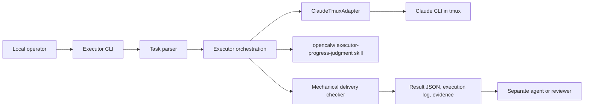
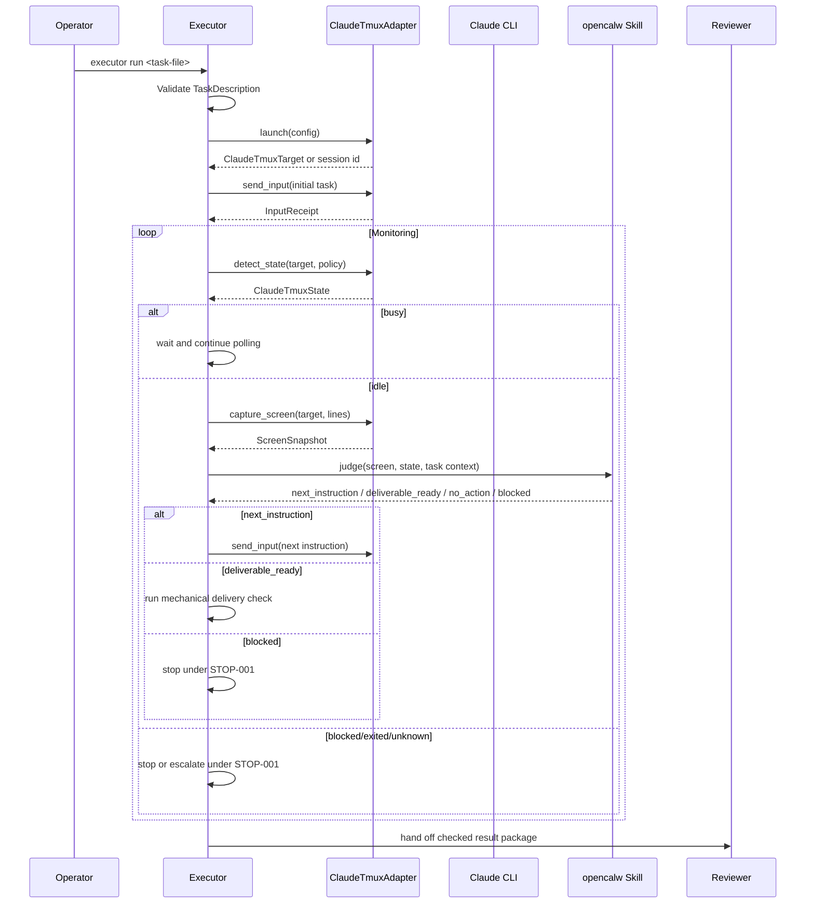
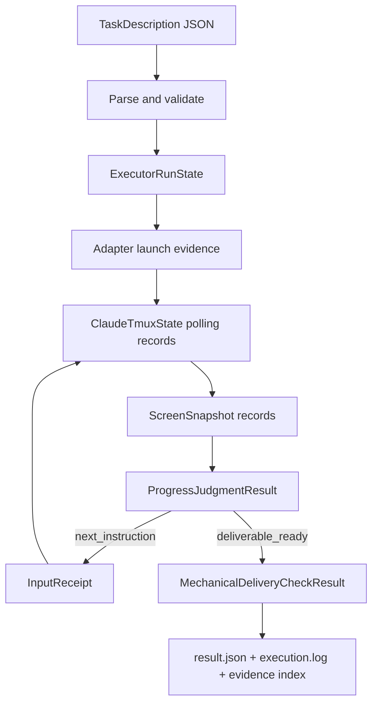
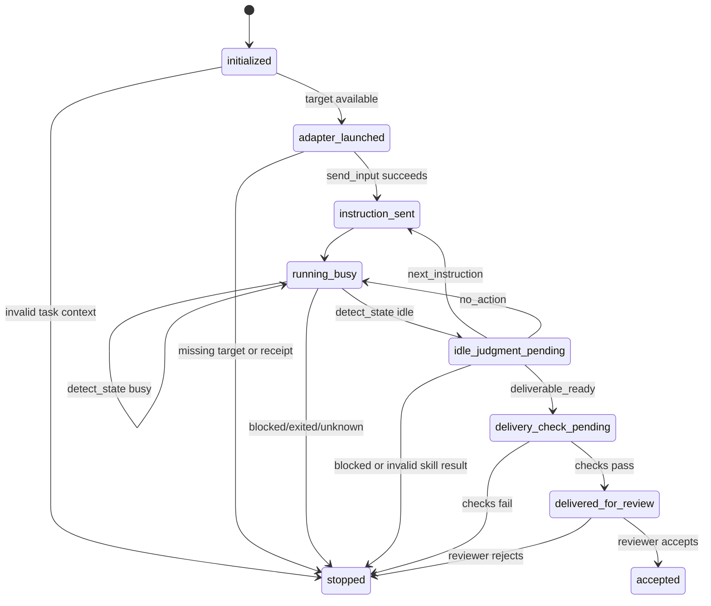

# Executor High-Level Design

## Revision History

| Version | Date | Change | Author |
| --- | --- | --- | --- |
| v1.0 | 2026-05-28 | Stage 3 HLD generated from the approved Human PRD, execution-ready Agent PRD, and canonical requirement table. | Agent |

## Scope And Goals

This HLD covers the `PHASE-001` Executor MVP. Executor is a local CLI program that accepts a task description, reads work environment, permissions, skill configuration, adapter configuration, and delivery standards, then drives Claude CLI through `ClaudeTmuxAdapter` rather than through direct process control. The current CLI boundary is `executor run <task-file>` [REQ-001][REQ-002][REQ-003][REQ-004][IN-001][DCT-001].

The design goal is to make Claude-backed task execution observable and reviewable. Executor must launch Claude CLI through `ClaudeTmuxAdapter`, send the initial task instruction, periodically inspect Claude CLI state through `detect_state`, capture the current screen through `capture_screen` when Claude is idle, invoke an `opencalw` progress-judgment skill, send any returned next instruction through `send_input`, and run mechanical delivery checks before reviewer handoff [REQ-006][REQ-007][REQ-008][EXE-001][VER-001].

Executor does not certify semantic task completion. It emits structured JSON, execution log, adapter evidence, progress-judgment evidence, and delivery-check evidence for a separate agent or reviewer to accept [REQ-005][OUT-001][DONE-001].

This document is design-ready, not an implementation-complete acceptance report. The product acceptance command in the Real Acceptance Plan is the real command that must be executed after the Executor CLI is built and installed in the local environment. Stage 3 proves that the acceptance design uses real local workspaces, real adapter documentation, and real task data; it does not claim that the future Executor product has already run.

## Architecture Overview



Executor orchestration owns task parsing, run state, monitoring policy, progress-skill invocation, mechanical delivery checks, and output assembly [MOD-001][FLOW-001]. `ClaudeTmuxAdapter` owns Claude CLI launch, target addressing, state detection, screen capture, input sending, output reading, and adapter evidence [MOD-002][TECH-001][SRC-005][SRC-006]. The `executor-progress-judgment` skill owns subjective idle-screen progress assessment and returns a constrained decision; it does not replace mechanical checks or reviewer acceptance [MOD-003][TECH-002].

## Control Flow



| Step | Trigger | Component | Required interaction | Failure behavior |
| --- | --- | --- | --- | --- |
| Load task | `executor run <task-file>` | Executor CLI and parser | Parse `TaskDescription` with work environment, permissions, skill configuration, adapter configuration, and delivery standard [IN-001][DCT-001] | Stop if the file is missing or invalid [STOP-001] |
| Launch Claude | Valid task context | ClaudeTmuxAdapter integration | Launch Claude CLI and record `ClaudeTmuxTarget` or session id [REQ-006][SRC-006] | Stop if target evidence is missing [STOP-001] |
| Send initial task | Target available | ClaudeTmuxAdapter integration | Call `send_input(target, content, submit)` and record `InputReceipt` [SRC-005] | Stop if the instruction cannot be sent [STOP-001] |
| Monitor state | Initial instruction sent | Executor monitoring loop | Periodically call `detect_state(target, DetectionPolicy)` and record `ClaudeTmuxState` [REQ-006] | Continue on `busy`; stop or escalate on `blocked`, `exited`, or unsupported `unknown` [STOP-001] |
| Judge idle progress | `detect_state` returns `idle` | Executor plus opencalw skill | Call `capture_screen(target, lines)`, then invoke `executor-progress-judgment` with screen data and context [REQ-007][AC-007] | Stop if screen capture or skill invocation fails [STOP-001] |
| Continue or deliver | Skill decision returned | Executor orchestration | Send `next_instruction` through `send_input`; run delivery checks on `deliverable_ready`; continue or stop on `no_action` or `blocked` [REQ-007][REQ-008] | Stop if required next instruction or evidence cannot be produced [STOP-001] |
| Handoff | Mechanical check passes | Delivery checker | Present `result.json`, `execution.log`, adapter evidence, progress evidence, and `delivery-check.json` to reviewer [OUT-001][DONE-001] | Do not claim semantic success without reviewer acceptance [DONE-001] |

## Data Flow



Task data enters through a local task file and becomes `TaskDescription`. Adapter data is captured as evidence records for launch, state, screen, input, and optional output reads. Idle screen data plus task context becomes the input to `executor-progress-judgment`. Delivery-check data becomes `delivery-check.json`, then the checked result package is handed to the reviewer [DATA-001][OUT-001].

## Data Objects

| Object | Key fields | Purpose | Lifecycle |
| --- | --- | --- | --- |
| `TaskDescription` | `task_id`, `description`, `work_environment`, `permissions`, `skill_configuration`, `delivery_standard` | Represents the task file accepted by the CLI [IN-001][DCT-001] | Loaded at CLI start, validated before adapter launch, summarized in result metadata |
| `ExecutorRunState` | `run_id`, `task_ref`, `adapter_target`, `current_status`, `evidence_index`, `stop_reason` | Tracks one executor invocation [FLOW-001][DATA-001] | Created after task validation, updated after every adapter or skill event, finalized in `result.json` |
| `AdapterEvidenceRecord` | `record_id`, `adapter_method`, `observed_at`, `payload_summary`, `evidence_path` | Audits each adapter call [REQ-006][MOD-002] | Appended for launch, state, screen, input, and output operations |
| `ProgressJudgmentResult` | `decision`, `next_instruction`, `reason`, `screen_evidence_ref`, `skill_evidence_path` | Records subjective idle-screen progress assessment [REQ-007][TECH-002] | Created after each idle-state skill invocation |
| `MechanicalDeliveryCheckResult` | `result_json_present`, `execution_log_present`, `adapter_evidence_present`, `progress_evidence_present`, `stop_done_consistency`, `passed` | Records deterministic delivery checks [REQ-008][AC-008] | Created only after `deliverable_ready`; required before handoff |

## Interface Contracts

Source-backed interface precision:

| Interface | Provider | Consumer | Source Evidence | Exact Invocation Boundary | Inputs | Outputs | Error Semantics |
| --- | --- | --- | --- | --- | --- | --- | --- |
| Executor CLI | Executor | Local operator | [SRC-001][SRC-002] | `executor run <task-file>` accepts exactly one task file and produces structured success or structured failure [REQ-004] | Task file matching `TaskDescription` | `result.json`, `execution.log`, evidence directories, `delivery-check.json` | Invalid file or context stops under [STOP-001] |
| ClaudeTmuxAdapter control | ClaudeTmuxAdapter | Executor adapter integration | [SRC-005][SRC-006] | Use the adapter public boundary only: launch with `launch_config` and retain the returned session target; call `detect_state(target, DetectionPolicy)` for status; call `capture_screen(target, lines)` before idle judgment; call `send_input(target, content, submit)` for initial and next instructions; call `read_output(target, ReadWindow)` for bounded output windows. Executor must not call tmux or Claude CLI directly. | Launch config, `ClaudeTmuxTarget`, detection policy, screen line window, instruction content, read window | `LaunchSessionResponse` or `ClaudeTmuxTarget`, `ClaudeTmuxState`, `ScreenSnapshot`, `InputReceipt`, `OutputWindow` | Adapter failure becomes stop evidence, not task success [REQ-006][STOP-001] |
| opencalw progress skill | `executor-progress-judgment` | Executor monitoring loop | [SRC-001][SRC-002] | Invoke through `opencalw` only after `detect_state` reports `idle` and `capture_screen` returns a current `ScreenSnapshot` [REQ-007] | Screen text, adapter state, task context, prior decisions, delivery criteria | `next_instruction`, `deliverable_ready`, `no_action`, `blocked` | Invalid or unsafe output stops or escalates under [STOP-001] |
| Reviewer handoff | Executor | Separate agent or reviewer | [SRC-002][SRC-007] | Handoff only after `delivery-check.json` passes; reviewer acceptance remains separate from executor mechanical success [DONE-001] | Checked result package | Semantic acceptance or rejection | Reviewer rejection stops the run under [STOP-001] |

## State Model



The state model separates mechanical adapter observations from semantic acceptance. `idle` only triggers screen capture and progress judgment; `deliverable_ready` only triggers delivery checks; `accepted` requires reviewer or separate-agent acceptance [TECH-001][TECH-002][DONE-001].

## Technical Decisions

| Decision | Rationale | Implementation notes |
| --- | --- | --- |
| Keep the MVP as a local CLI | [REQ-004] and [SRC-002] confirm local CLI as the first implementation boundary | Implement `executor run <task-file>` as the canonical entry point; reject untraced library, API, hosted, or scheduler modes [BAR-001] |
| Route Claude control through `ClaudeTmuxAdapter` | [REQ-003], [REQ-006], [SRC-005], and [SRC-006] define adapter-controlled launch, state, screen, input, and output operations | Wrap adapter calls behind an Executor adapter port and persist `ClaudeTmuxTarget`, `ClaudeTmuxState`, `ScreenSnapshot`, `InputReceipt`, and `OutputWindow` evidence |
| Keep subjective progress judgment outside the adapter | [TECH-002] requires a dedicated `opencalw` skill while adapter state remains mechanical | Call the skill only after idle state and screen capture; accept only `next_instruction`, `deliverable_ready`, `no_action`, or `blocked` |
| Require mechanical checks before handoff | [REQ-008] and [AC-008] require evidence completeness before delivery, while [DONE-001] reserves semantic success for a reviewer | Check JSON, log, adapter evidence, progress evidence, sent instructions, and stop/done consistency before handoff |

## Implementation Design

Executor should be implemented around five boundaries, not as a task-plan decomposition:

| Boundary | Design |
| --- | --- |
| CLI and task parser | Parse the task file into `TaskDescription`, validate work environment, permissions, skill configuration, adapter configuration, and delivery standard, then initialize `ExecutorRunState` [REQ-001][REQ-002][IN-001]. |
| ClaudeTmuxAdapter port | Expose only documented adapter semantics needed by Executor: launch returns `LaunchSessionResponse` or `ClaudeTmuxTarget`; `detect_state` returns `ClaudeTmuxState`; `capture_screen` returns `ScreenSnapshot`; `send_input` returns `InputReceipt`; `read_output` returns `OutputWindow`. Every call returns a typed value or structured failure plus evidence [REQ-006][SRC-005][SRC-006]. |
| Monitoring loop | Poll `detect_state`; continue on `busy`; capture screen and invoke the progress skill on `idle`; stop on `blocked`, `exited`, or unsupported `unknown` unless a future requirement defines a recovery path [EXE-001][STOP-001]. |
| Progress-judgment skill | Implement `executor-progress-judgment` as an `opencalw` skill with structured input and one of four structured outputs. It owns subjective steering only [REQ-007][MOD-003]. |
| Delivery checker and output writer | After `deliverable_ready`, write `delivery-check.json`, `result.json`, `execution.log`, `adapter-evidence/`, and `progress-judgment-evidence/`; do not claim semantic task success [REQ-008][DONE-001]. |

## Real Acceptance Plan

Executable acceptance design:

| Acceptance Element | Concrete Value |
| --- | --- |
| Environment | `C:/Users/54256213/Documents/github/spec-skills/skills/spec-intake/tests/live-runs/2026-05-28/executor-stage3-hld`, with `ClaudeTmuxAdapter` documentation and implementation at `C:/Users/54256213/Documents/github/claude-tmux-adapter` [SRC-008][SRC-005][SRC-006] |
| Real Data | `C:/Users/54256213/Documents/github/spec-skills/skills/spec-intake/tests/live-runs/2026-05-28/executor-stage3-hld/acceptance/executor-real-task.json` [SRC-009] |
| Acceptance Owner | Human reviewer who authorized Stage 3 execution and accepts the HLD package [SRC-007] |
| Substitute Policy | `mock_policy=forbidden`; mock, stub, fake, simulated, and synthetic acceptance data are not allowed |

Acceptance Command:

```bash
executor run C:/Users/54256213/Documents/github/spec-skills/skills/spec-intake/tests/live-runs/2026-05-28/executor-stage3-hld/acceptance/executor-real-task.json
```

Preconditions:

| Precondition | Source |
| --- | --- |
| Executor CLI has been implemented and is callable from a real build output or PATH; Stage 3 does not claim this product command has already run | [REQ-004][VER-001] |
| Claude CLI and tmux-compatible session control are available in the local environment | [REQ-006][SRC-005][SRC-006] |
| `ClaudeTmuxAdapter` is available from `C:/Users/54256213/Documents/github/claude-tmux-adapter` | [SRC-005][SRC-006] |
| `executor-progress-judgment` is callable through `opencalw` | [REQ-007][MOD-003] |

Expected Artifact Paths:

| Artifact | Required purpose |
| --- | --- |
| `result.json` | Structured executor result and evidence index; this is the HLD's minimum artifact name, not a full JSON schema [OUT-001] |
| `execution.log` | CLI, parsing, adapter, monitoring, skill, and handoff log [OUT-001] |
| `delivery-check.json` | Deterministic delivery-check result [REQ-008] |
| `adapter-evidence/` | Adapter launch, state, screen, input, and output evidence [REQ-006] |
| `progress-judgment-evidence/` | `opencalw` request and response records [REQ-007] |
| `reviewer-acceptance-record.md` | Separate reviewer or agent acceptance record [DONE-001] |

Mechanical Checks:

| Check | Pass condition |
| --- | --- |
| Task parsing | `TaskDescription` contains environment, permissions, skill configuration, adapter configuration, and delivery standard; this is the minimum HLD input object, not a complete product schema [REQ-002][IN-001] |
| Adapter evidence | `ClaudeTmuxTarget`, `ClaudeTmuxState`, `ScreenSnapshot`, and `InputReceipt` records exist [REQ-006][SRC-005] |
| Idle judgment | Every idle judgment includes a captured screen plus `opencalw` request and response [REQ-007][AC-007] |
| Delivery completeness | `result.json`, `execution.log`, adapter evidence, progress evidence, and `delivery-check.json` exist [REQ-008][OUT-001] |
| Stop/done consistency | Final status agrees with [STOP-001] and [DONE-001] and does not self-certify semantic task completion |

Failure Criteria:

| Failure | Reason |
| --- | --- |
| Claude CLI is controlled without `ClaudeTmuxAdapter` evidence | Violates [REQ-003][REQ-006][TECH-001] |
| Idle state is judged without `ScreenSnapshot` and `opencalw` response evidence | Violates [REQ-007][AC-007] |
| `deliverable_ready` bypasses mechanical delivery checks | Violates [REQ-008][AC-008] |
| Executor claims semantic task completion without reviewer acceptance | Violates [REQ-005][DONE-001] |
| Any required result, log, or evidence artifact is absent | Violates [OUT-001][VER-001] |

## Risks And Guardrails

| Risk | Guardrail |
| --- | --- |
| Adapter idle state is mistaken for task completion | Adapter state remains mechanical evidence only; subjective judgment is delegated to `opencalw`, and semantic acceptance remains with the reviewer [TECH-001][TECH-002][DONE-001] |
| Progress skill returns unsafe or ambiguous output | Executor accepts only the four allowed outputs and stops on invalid output [REQ-007][STOP-001] |
| Incomplete evidence is delivered | Mechanical delivery checks must pass before handoff [REQ-008][AC-008] |
| HLD introduces unapproved API, scheduler, schema, or hosted execution | New modes require requirement-table revision before inclusion [BAR-001] |

## References

- `contract-envelope.json`: canonical requirement table and source-of-truth contract.
- `agent-prd.md`: execution-ready Agent PRD.
- `human-prd.md`: approved Human PRD brief.
- `high-level-design.json`: structured HLD source.
- `hld-semantic-review.json`: independent semantic review artifact.
- `acceptance/executor-real-task.json`: real acceptance task data [SRC-009].
- `C:/Users/54256213/Documents/github/claude-tmux-adapter/README.md`: `ClaudeTmuxAdapter` method and evidence source [SRC-005].
- `C:/Users/54256213/Documents/github/claude-tmux-adapter/docs/agent-prd.md`: adapter launch, capture, status, input, and termination source [SRC-006].
- Current design refs: [REQ-001][REQ-002][REQ-003][REQ-004][REQ-005][REQ-006][REQ-007][REQ-008][AC-001][AC-002][AC-003][AC-004][AC-005][AC-006][AC-007][AC-008][IN-001][DCT-001][FLOW-001][DATA-001][MOD-001][MOD-002][MOD-003][TECH-001][TECH-002][EXE-001][VER-001][OUT-001][STOP-001][DONE-001].
