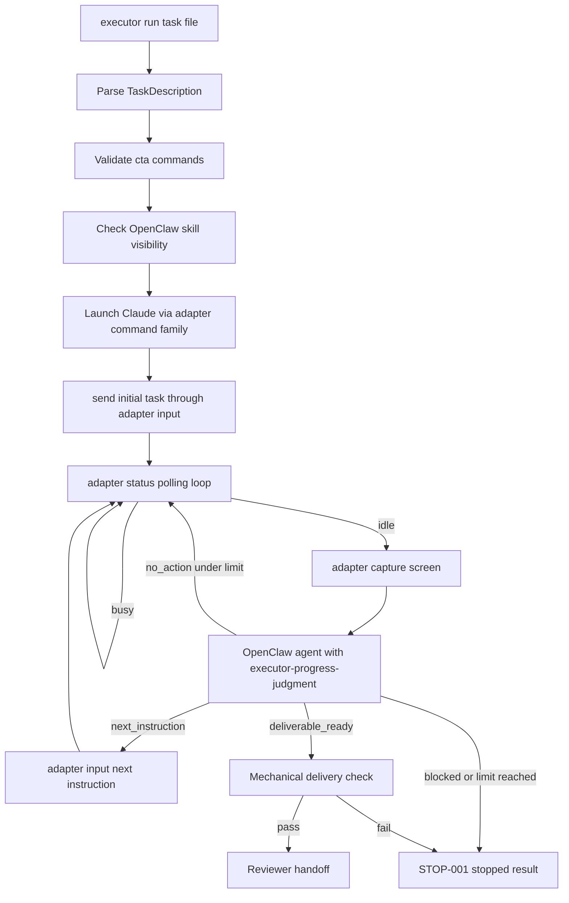

# Executor High-Level Design

## Revision History

| Version | Date | Change | Author |
| --- | --- | --- | --- |
| v1.1 | 2026-05-28 | Hardened cta command-surface contract, task/result/progress schemas, monitoring policy, OpenClaw JSON exchange, and concrete acceptance workspace after manual HLD review. | Agent |
| v1.0 | 2026-05-28 | Initial ready HLD generated from approved PRDs, requirement table, ClaudeTmuxAdapter local evidence, OpenClaw official CLI references, and concrete acceptance inputs. | Agent |

## Scope And Goals

Executor is a local CLI orchestrator. It accepts one JSON or YAML task file, validates work context, permission boundaries, LaunchConfig generation, cta command-surface readiness, and OpenClaw skill visibility, drives Claude CLI through ClaudeTmuxAdapter 1.0.0 command families, invokes OpenClaw with the `executor-progress-judgment` skill for idle-screen progress judgment, runs mechanical delivery checks, and emits result, log, adapter evidence, progress evidence, and reviewer handoff artifacts [REQ-001][REQ-002][REQ-003][REQ-004][REQ-005][REQ-010]. The scope excludes direct tmux control, direct Claude process control, remote execution, queues, concurrency, hosted APIs, and inline subjective progress judgment [OOS-001][BAR-001].

## Architecture Overview

`contract-envelope.json` and `high-level-design.json` are the source artifacts for this document. The architecture separates mechanical control from subjective progress judgment. ClaudeTmuxAdapter supplies the actual `cta` CLI with `launch`, `capture`, `status`, `input`, and `exit` subcommands; Executor generates the adapter `LaunchConfig`, calls `cta` commands directly, and normalizes their JSON output; OpenClaw runs the packaged progress-judgment skill; Executor validates decisions, enforces monitoring limits, runs mechanical checks, and emits evidence [SRC-003][SRC-004][SRC-005][SRC-008][SRC-009][SRC-010][SRC-013][SRC-015][SRC-016][SRC-017][SRC-018][SRC-019].

## Control Flow

| Step | Trigger | Actor | Action | Failure Branch |
| --- | --- | --- | --- | --- |
| Load task | `executor run <task-file>` | Executor CLI | Parse JSON/YAML into TaskDescription and initialize ExecutorRunState [REQ-001][REQ-002][IN-001][DCT-001] | Stop on unreadable file, missing fields, invalid refs, or permission violation [STOP-001] |
| Preflight integrations | Valid task | Executor preflight | Validate cta commands for launch/capture/status/input/exit and run `openclaw skills check --agent executor-progress-agent --json` [REQ-003][REQ-010][SRC-008][SRC-013] | Stop if a command family is absent, command-shape probe fails, or skill is absent [STOP-001] |
| Launch Claude | Preflight passes | ClaudeTmuxAdapter port | Invoke adapter launch family and record `LaunchSessionResponse` [REQ-003][REQ-006][TECH-001] | Stop on launch failure or missing `session_id` [STOP-001] |
| Monitor | Target exists | Executor loop | Send initial task, poll status every 5 seconds, preserve evidence [FLOW-001][STATE-001][EXE-001] | Stop on blocked, exited, timeout, two consecutive unknown states, six consecutive no-action decisions, or 7200 seconds total runtime [STOP-001] |
| Judge idle | Adapter reports idle | OpenClaw integration | Capture screen, write `progress-judgment-request.json`, run `openclaw agent --agent executor-progress-agent --session-key agent:executor-progress-agent:${run_id} --message "Use the executor-progress-judgment skill. Read the progress request JSON from progress-judgment-evidence/${run_id}/${iteration}/progress-judgment-request.json. Write the decision JSON to progress-judgment-evidence/${run_id}/${iteration}/progress-decision.json. Return a concise summary." --local --timeout 180 --json`, and parse `progress-decision.json` as `OpenClawProgressDecision` [REQ-007][REQ-010] | Stop on invalid screen capture, non-JSON output, invalid decision file, unsafe instruction, low-confidence deliverable_ready, or command failure [STOP-001] |
| Handoff | `deliverable_ready` decision | Delivery checker | Verify required artifacts and consistency, then emit reviewer handoff [REQ-005][REQ-008][REQ-009] | Stop if any mechanical check fails [STOP-001] |

## Data Flow

| Flow | Source | Transformation | Target | Retention |
| --- | --- | --- | --- | --- |
| Task input | JSON/YAML task file [IN-001] | Normalize working directory, permissions, cta command surface, skill config, monitoring policy, docs, and delivery standard [DCT-001] | ExecutorRunState [DATA-001] | result metadata and execution.log [OUT-001] |
| Adapter evidence | Adapter command families [REQ-006] | Convert launch, capture, status, input, and exit envelopes into AdapterEvidenceRecord | adapter-evidence/, result evidence index | Retained for review [OUT-001] |
| Progress judgment | Idle ScreenSnapshot plus task context [REQ-007] | Serialize `OpenClawProgressRequest`, invoke OpenClaw agent with `executor-progress-judgment`, parse `OpenClawProgressDecision` [REQ-010] | next branch, evidence, delivery trigger, or stop record | progress-judgment-evidence/ [OUT-001] |
| Delivery evidence | Result candidate, logs, adapter evidence, progress evidence [REQ-008] | Run deterministic completeness checks | delivery-check.json and reviewer handoff | Retained as final deliverable evidence [DONE-001] |

## Data Objects

| Object | Required Fields | Key Rules |
| --- | --- | --- |
| TaskDescription | task_id, working_directory, task_description, permissions, adapter, skill_configuration, monitoring_policy, reference_documents, delivery_standard | `adapter` must include `launch_config` and `command_map`; paths are normalized under working_directory unless explicitly allowed; missing fields trigger [STOP-001]. |
| LaunchConfigArtifact | workspace, config_values, permission_settings, claude_md, task_prompt | Generated from TaskDescription and written to `adapter-evidence/${run_id}/launch-config.json`; `workspace=working_directory`, `config_values={}` for acceptance, `permission_settings=Default`, `claude_md` is Content generated from task context, and `task_prompt` combines task description, references, and delivery standard [SRC-018]. |
| CtaCommandSurface | binary, launch, capture, status, input, exit, normalization_policy | Exact commands are `cta launch --config`, `cta capture --session-id`, `cta status --session-id --samples 3 --interval 2`, `cta input --session-id --instruction`, and `cta exit --session-id --mode`; Executor normalizes documented envelopes and current v1.0.0 direct evidence shapes [SRC-015][SRC-016][SRC-017]. |
| OpenClawProgressRequest | run_id, screen_snapshot_ref, screen_text, adapter_state, task_context, prior_decisions, allowed_decisions | Written to `progress-judgment-request.json` before OpenClaw invocation [REQ-010]. |
| OpenClawProgressDecision | decision, rationale, confidence, screen_evidence_ref, openclaw_evidence_path, optional next_instruction | decision is exactly `next_instruction`, `deliverable_ready`, `no_action`, or `blocked`; low confidence cannot produce `deliverable_ready` [AC-010]. |
| ExecutorRunState | run_id, task_ref, current_status, counters, evidence_index, optional adapter_target, optional stop_reason | Counters include poll_count, consecutive_no_action, consecutive_unknown_state, and elapsed_seconds [STATE-001]. |
| MechanicalDeliveryCheckResult | result_json_present, execution_log_present, adapter_evidence_present, progress_evidence_present, stop_done_consistency, passed | `passed=true` only when every required artifact and consistency check passes [REQ-008]. |

## Interface Contracts

Source-backed interface precision is mandatory: every external command boundary cites evidence, defines invocation behavior, and defines error semantics.

| Interface | Provider | Consumer | Source Evidence | Exact Invocation Boundary | Inputs | Outputs | Error Semantics |
| --- | --- | --- | --- | --- | --- | --- | --- |
| Executor CLI | Executor | Operator | [SRC-001][SRC-002] | `executor run <task-file> --output-dir <output-dir>` | JSON/YAML TaskDescription [IN-001] | result.json, execution.log, delivery-check.json, evidence dirs [OUT-001] | Structured stopped result on invalid input or failed dependency [STOP-001] |
| ClaudeTmuxAdapter cta CLI | ClaudeTmuxAdapter 1.0.0 | Executor | [SRC-015][SRC-016][SRC-017][SRC-018][SRC-005] | `cta launch --config <launch-config.json>`; `cta capture --session-id <id>`; `cta status --session-id <id> --samples 3 --interval 2`; `cta input --session-id <id> --instruction <text>`; `cta exit --session-id <id> --mode graceful|force`; never call tmux or Claude CLI directly | LaunchConfig generated as `workspace=working_directory`, `config_values={}`, `permission_settings=Default`, `claude_md=Content(...)`, `task_prompt=task_description + references + delivery_standard`; session id, instruction, status samples/interval, exit mode | LaunchSessionResponse/StructuredScreen/StatusDiff direct JSON or CommandResult envelopes | Non-zero exit, stderr preflight failure, non-JSON stdout, missing field, or `success=false` stops [STOP-001] |
| OpenClaw skill installation | OpenClaw skills CLI | Executor setup | [SRC-008][SRC-010][SRC-019] | `openclaw skills install C:/Users/54256213/Documents/github/spec-skills/skills/spec-intake/tests/live-runs/2026-05-28/executor-strict-full-chain-final/skills/executor-progress-judgment --as executor-progress-judgment --agent executor-progress-agent` | existing local skill directory `C:/Users/54256213/Documents/github/spec-skills/skills/spec-intake/tests/live-runs/2026-05-28/executor-strict-full-chain-final/skills/executor-progress-judgment`, skill slug, agent id | install/update status | Failed install or absent skill stops before Claude launch [STOP-001] |
| OpenClaw skill visibility | OpenClaw skills CLI | Executor | [SRC-008][SRC-010] | `openclaw skills check --agent executor-progress-agent --json` | agent id and required skill name | JSON skill visibility report | Missing skill stops before Claude launch [STOP-001] |
| OpenClaw progress judgment | OpenClaw agent CLI plus skill | Executor | [SRC-006][SRC-008][SRC-009][SRC-010] | `openclaw agent --agent executor-progress-agent --session-key agent:executor-progress-agent:${run_id} --message "Use the executor-progress-judgment skill. Read the progress request JSON from progress-judgment-evidence/${run_id}/${iteration}/progress-judgment-request.json. Write the decision JSON to progress-judgment-evidence/${run_id}/${iteration}/progress-decision.json. Return a concise summary." --local --timeout 180 --json` | Message names `progress-judgment-request.json` input and `progress-decision.json` output paths | OpenClaw stdout/stderr/exit status plus canonical `progress-decision.json` | Timeout, non-JSON output, missing decision file, invalid decision, unsafe instruction, or low-confidence deliverable_ready stops [STOP-001] |
| Reviewer handoff | Executor | Reviewer/separate agent | [SRC-001][SRC-002][SRC-007] | Read result and evidence artifacts from run output directory | result, logs, adapter evidence, progress evidence | semantic acceptance record | Rejection is recorded separately from adapter evidence [DONE-001] |

## State Model

| State | Owner | Transitions |
| --- | --- | --- |
| initialized | Executor CLI | to integration_preflight after validation; to stopped on invalid context [REQ-001][STOP-001] |
| integration_preflight | Executor preflight | to adapter_launching after cta command-surface probe and OpenClaw skill check pass; to stopped on probe or skill failure [REQ-003][REQ-010] |
| adapter_launching | ClaudeTmuxAdapter port | to running_busy after target/session evidence; to stopped on launch failure [REQ-003][REQ-006] |
| running_busy | Executor loop | remain while busy; to idle_judgment_pending on idle; to stopped on blocked, exited, timeout, or unknown limit [STATE-001][FLOW-001] |
| idle_judgment_pending | OpenClaw integration | to instruction_sent, delivery_check_pending, running_busy, or stopped based on validated OpenClawProgressDecision [REQ-007][REQ-010] |
| instruction_sent | ClaudeTmuxAdapter port | to running_busy after input evidence; to stopped on input failure [AC-007][TECH-001] |
| delivery_check_pending | Delivery checker | to delivered_for_review on pass; to stopped on missing artifact or inconsistent state [REQ-008][REQ-009] |
| delivered_for_review | Reviewer/separate agent | to accepted on semantic approval; to stopped on rejection [REQ-005][DONE-001] |

## Technical Decisions

| Decision | Rationale | Implementation Notes |
| --- | --- | --- |
| Local single-run CLI | Current phase is local sequential MVP [PHASE-001][SCOPE-001] | Implement `executor run <task-file> --output-dir <output-dir>` and reject remote, queue, concurrency, and hosted modes [OOS-001]. |
| Actual cta CLI | Adapter implementation confirms binary `cta`, subcommands, arguments, and JSON outputs [SRC-015][SRC-016][SRC-017] | Use exact argv-array subprocess calls for `cta`; normalize documented and current v1.0.0 stdout shapes; capture stdout, stderr, exit code, and parsed JSON [STOP-001]. |
| OpenClaw agent-mode skill judgment | Official docs support skills visibility and agent one-shot execution [SRC-008][SRC-009][SRC-010] | Install/check the skill with `openclaw skills`, write request JSON to evidence, invoke `openclaw agent --agent ... --message ... --local --timeout 180 --json`, parse the decision file as canonical JSON, and persist stdout/stderr/exit status [REQ-010]. |
| Explicit monitoring limits | A loop without limits can hang or over-drive tools | Defaults: poll=5s, state timeout=30s, capture timeout=30s, OpenClaw timeout=180s, no_action limit=6, unknown limit=2, run limit=7200s [STOP-001]. |
| Mechanical delivery check | Completion must not come from adapter state or screen text alone [REQ-008][DONE-001][BAR-001] | Verify result, log, adapter evidence, progress evidence, delivery check, counters, and consistency before handoff. |

## Implementation Design

Executor implementation has six concerns. The CLI/parser validates `TaskDescription`, path containment, field types, permissions including `cta`, `adapter.launch_config`, actual `cta` command surface, monitoring policy, OpenClaw config, and evidence directories [REQ-001][REQ-002][DCT-001]. The adapter port generates and retains `LaunchConfigArtifact`, executes only configured ClaudeTmuxAdapter command families, and validates structured JSON envelopes [REQ-003][REQ-006][SRC-013]. The `executor-progress-judgment` skill package exists at `C:/Users/54256213/Documents/github/spec-skills/skills/spec-intake/tests/live-runs/2026-05-28/executor-strict-full-chain-final/skills/executor-progress-judgment/SKILL.md` and defines screen-evidence input, decision rubric, JSON schema, confidence rules, and safety checks [REQ-010][AC-010]. The OpenClaw integration checks skill visibility, invokes `openclaw agent`, validates decisions, and stores request-response evidence [SRC-008][SRC-009][SRC-010]. The monitoring loop enforces polling, timeout, unknown-state, no-action, and run-duration limits [STATE-001][FLOW-001]. The delivery checker writes and verifies final artifacts before reviewer handoff [REQ-008][REQ-009][OUT-001].

## Real Acceptance Plan

Executable acceptance design uses the concrete local task workspace, task file, reference document, and output directory recorded in `high-level-design.json` [SRC-011][SRC-012][SRC-014].

| Item | Value |
| --- | --- |
| Acceptance Command | `executor run C:/Users/54256213/Documents/github/spec-skills/skills/spec-intake/tests/live-runs/2026-05-28/executor-strict-full-chain-final/acceptance/executor-real-task.json --output-dir C:/Users/54256213/Documents/github/spec-skills/skills/spec-intake/tests/live-runs/2026-05-28/executor-strict-full-chain-final/acceptance-output/executor-openclaw-adapter-real-acceptance-001` |
| Environment | `C:/Users/54256213/Documents/github/spec-skills/skills/spec-intake/tests/live-runs/2026-05-28/executor-strict-full-chain-final/acceptance/workspace` with output directory `C:/Users/54256213/Documents/github/spec-skills/skills/spec-intake/tests/live-runs/2026-05-28/executor-strict-full-chain-final/acceptance-output/executor-openclaw-adapter-real-acceptance-001` and local ClaudeTmuxAdapter at `C:/Users/54256213/Documents/github/claude-tmux-adapter` [SRC-011][SRC-003][SRC-005] |
| Real Data | `C:/Users/54256213/Documents/github/spec-skills/skills/spec-intake/tests/live-runs/2026-05-28/executor-strict-full-chain-final/acceptance/executor-real-task.json` sha256 `3a4020e029be8dae9bcc32ec8dd3c418e48cbb2485881ece1235c74c222c9fb6`; reference doc `C:/Users/54256213/Documents/github/spec-skills/skills/spec-intake/tests/live-runs/2026-05-28/executor-strict-full-chain-final/acceptance/workspace/docs/executor-operator-brief.md` sha256 `b749ae76111958283dd5ded4aa0c1c5dc9565ba8237fe90eac122e43e907b807`; skill `C:/Users/54256213/Documents/github/spec-skills/skills/spec-intake/tests/live-runs/2026-05-28/executor-strict-full-chain-final/skills/executor-progress-judgment/SKILL.md` sha256 `39c2b623cbb995b4156a4ebd3f69d7f3f5a34246d5bc413b3a8922cc71c343a9` [SRC-012][SRC-014][SRC-019] |
| Owner | Human reviewer recorded by [SRC-007] |

### Preconditions

- Executor CLI is installed from the real implementation build and callable from the acceptance shell.
- Claude CLI and tmux-compatible session control are available.
- ClaudeTmuxAdapter 1.0.0 source and docs are available at `C:/Users/54256213/Documents/github/claude-tmux-adapter` [SRC-005].
- The `cta` binary is callable; command-shape probes pass for `cta launch`, `cta capture`, `cta status`, `cta input`, and `cta exit` [SRC-015][SRC-016][SRC-017].
- `openclaw skills install C:/Users/54256213/Documents/github/spec-skills/skills/spec-intake/tests/live-runs/2026-05-28/executor-strict-full-chain-final/skills/executor-progress-judgment --as executor-progress-judgment --agent executor-progress-agent` installs or updates the existing local progress-judgment skill when absent [SRC-008][SRC-010][SRC-019].
- `openclaw skills check --agent executor-progress-agent --json` confirms `executor-progress-judgment` visibility [SRC-008][SRC-010].
- The concrete task file, reference document, and progress-judgment skill hashes match the values above [SRC-012][SRC-014][SRC-019].

### Expected Artifact Paths

| Artifact | Purpose |
| --- | --- |
| result.json | Run identity, task hash, final status, cta command-surface source, monitoring counters, and evidence index [OUT-001] |
| execution.log | CLI invocation, task parsing, adapter preflight, launch, polling, idle capture, OpenClaw invocation, decision routing, and handoff [REQ-009] |
| delivery-check.json | Mechanical check result [REQ-008] |
| adapter-evidence/ | Generated `launch-config.json`, `cta` command-shape probe, launch, status, capture, input, and exit evidence [REQ-006] |
| progress-judgment-evidence/ | OpenClaw request, stdout, stderr, exit status, and parsed decision records [REQ-010] |
| reviewer-acceptance-record.md | Semantic acceptance handoff [DONE-001] |

### Mechanical Checks

- Verify `result.json` exists and contains run identity, final status, task hash, cta command-surface source, monitoring counters, and evidence index.
- Verify `execution.log` records CLI invocation, task parsing, adapter preflight, adapter launch, polling, idle capture, OpenClaw invocation, decision routing, and handoff.
- Verify `adapter-evidence/` contains generated `launch-config.json` with sha256, launch, status, capture, input, and command-shape probe records.
- Verify `progress-judgment-evidence/` contains `OpenClawProgressRequest`, raw OpenClaw stdout/stderr/exit status, and parsed `OpenClawProgressDecision` records for each idle judgment.
- Verify `delivery-check.json` passes only when result, log, adapter evidence, progress evidence, monitoring counters, and stop/done consistency are present [VER-001].

### Failure Criteria

- Fail if Claude CLI is controlled outside ClaudeTmuxAdapter evidence.
- Fail if generated LaunchConfig is missing, not retained as evidence, or omits workspace, config_values, permission_settings, claude_md, or task_prompt.
- Fail if `cta` is unavailable or a required `cta` subcommand probe fails.
- Fail if idle state is judged without ScreenSnapshot evidence and OpenClawProgressDecision evidence.
- Fail if `executor-progress-judgment` is absent from the configured OpenClaw agent skill set.
- Fail if no-action, unknown-state, or total-runtime limits are ignored.
- Fail if `deliverable_ready` bypasses mechanical delivery checks.
- Fail if Executor declares semantic task success without reviewer or separate-agent acceptance.
- Fail if any required result, log, or evidence artifact is absent [STOP-001].

## Risks And Guardrails

The primary risk is conflating adapter mechanical state with task success. The guardrail is a strict chain: cta command-surface preflight first, adapter state and screen evidence second, OpenClaw skill judgment third, mechanical delivery checks fourth, reviewer acceptance last [RISK-001][BAR-001][DONE-001]. A second risk is inventing unsupported adapter or OpenClaw commands. This HLD does not invent ClaudeTmuxAdapter binary flags; it requires source-confirmed `cta` command families and exact argv calls. It also uses official OpenClaw skills and agent CLI boundaries rather than a direct `skill run` command [SRC-008][SRC-009][SRC-010][SRC-013]. Contract coverage: REQ-001 REQ-002 REQ-003 REQ-004 REQ-005 REQ-006 REQ-007 REQ-008 REQ-009 REQ-010 AC-001 AC-002 AC-003 AC-004 AC-005 AC-006 AC-007 AC-008 AC-009 AC-010 MET-001 FLOW-001 DATA-001 MOD-001 MOD-002 MOD-003 TECH-001 TECH-002 STATE-001 DCT-001 IN-001 EXE-001 VER-001 OUT-001 STOP-001 DONE-001 RISK-001 BAR-001 ASM-001 ASM-002 PHASE-001 SCOPE-001 OOS-001.

## References

- [SRC-001] Original user idea.
- [SRC-002] Stage 1 user clarifications.
- [SRC-003] ClaudeTmuxAdapter README.
- [SRC-004] ClaudeTmuxAdapter Agent PRD.
- [SRC-005] User-confirmed ClaudeTmuxAdapter version 1.0.0.
- [SRC-006] PRD revision feedback requiring dedicated OpenClaw progress-judgment skill.
- [SRC-007] Human PRD approval and Stage 3 authorization.
- [SRC-008] OpenClaw official CLI skills documentation: https://docs.openclaw.ai/cli/skills.
- [SRC-009] OpenClaw official CLI agent documentation: https://docs.openclaw.ai/cli/agent.
- [SRC-010] OpenClaw official skill format documentation: https://docs.openclaw.ai/skills/skill-format.
- [SRC-011] Concrete final live-run environment.
- [SRC-012] Concrete executor acceptance task file.
- [SRC-013] ClaudeTmuxAdapter task-001 CLI command surface spec.
- [SRC-014] Concrete executor acceptance workspace document.
- [SRC-015] ClaudeTmuxAdapter CLI implementation: `src/cli/mod.rs`.
- [SRC-016] ClaudeTmuxAdapter runtime dispatch: `src/main.rs`.
- [SRC-017] ClaudeTmuxAdapter CLI reference: `docs/cli.md`.
- [SRC-018] ClaudeTmuxAdapter LaunchConfig implementation: `src/config/mod.rs`.
- [SRC-019] Concrete executor-progress-judgment skill package: `skills/executor-progress-judgment/SKILL.md`.
