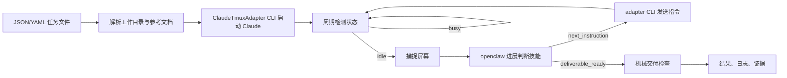

# Executor Human PRD

## 修订记录
| 版本 | 日期 | 修订说明 | 修订人 |
| --- | --- | --- | --- |
| v1.1 | 2026-05-28 | 明确 openclaw 必须通过专用进展判断技能处理 Claude CLI 屏幕内容并输出下一步指令。 | Agent |
| v1.0 | 2026-05-28 | 根据已确认的输入契约、ClaudeTmuxAdapter CLI 边界与 MVP 交付检查边界形成评审简报。 | Agent |

## 产品目标
Executor 的目标是提供一个本地 CLI 执行器：用户提交 JSON 或 YAML 任务描述文件后，系统读取工作目录、任务描述、权限、技能配置、交付标准、交付方法和参考文档列表，并驱动 Claude CLI 完成任务。它的价值在于复用 ClaudeTmuxAdapter 1.0.0 的机械会话控制能力，同时开发一个 openclaw 可调用的进展判断技能，用该技能基于 Claude CLI 屏幕内容判断进展并输出下一步指令，避免 executor 自行臆断任务完成状态。[CORE-001][REQ-001][REQ-002][REQ-003][REQ-010][SRC-001][SRC-002][SRC-005][SRC-006]

## 建设范围
| 范围项 | 当前结论 | 依据 |
| --- | --- | --- |
| 输入 | 仅接受一个 JSON/YAML 任务描述文件路径；参考文档放在工作目录内，并由任务文件列出。 | [IN-001][REQ-002][SRC-002] |
| 执行边界 | 通过 ClaudeTmuxAdapter CLI 启动、观测、截屏、发送输入和读取输出，不直接操作 Claude CLI 或 tmux。 | [REQ-003][TECH-001][SRC-003][SRC-004][SRC-005] |
| 判断边界 | ClaudeTmuxAdapter 只提供机械状态和屏幕证据；idle 时必须调用专用 openclaw 进展判断技能，由该技能判断进展并输出 next_instruction、deliverable_ready、no_action 或 blocked。 | [REQ-007][REQ-010][AC-010][TECH-002][SRC-003][SRC-006] |
| 交付边界 | 交付前必须完成机械检查，并输出结果、日志和证据；语义验收由独立 agent/reviewer 承担。 | [REQ-005][REQ-008][DONE-001] |

## 实现方案
Executor 采用“任务文件解析 -> adapter 启动 Claude -> 周期监控 -> idle 截屏 -> openclaw 进展判断技能 -> 发送下一步或交付检查”的闭环。监控中如果 Claude 处于 busy，executor 继续轮询；如果处于 idle，executor 通过 ClaudeTmuxAdapter CLI 捕捉当前屏幕，将屏幕、任务上下文和历史判断交给专用进展判断技能；如果技能返回 next_instruction，则继续通过 adapter CLI 发送；如果返回 deliverable_ready，则进入机械交付检查。[FLOW-001][EXE-001][MOD-001][MOD-002][MOD-003][DATA-001][REQ-010]

## 验收标准与方法
| 验收项 | 标准 | 方法 |
| --- | --- | --- |
| 输入校验 | JSON/YAML 文件缺少工作目录、任务描述、权限、技能配置、交付标准、交付方法或参考文档列表时必须停止。 | 构造有效和无效任务文件执行 CLI 验证。[AC-002][VER-001] |
| Adapter 边界 | 启动、状态/屏幕观测、发送输入和读取输出均经 ClaudeTmuxAdapter CLI。 | 检查命令调用路径和运行证据。[AC-003][AC-007] |
| 进展判断技能 | idle 状态必须捕捉屏幕并调用 openclaw 进展判断技能；技能必须接收屏幕证据和任务上下文，输出结构化进展判断和下一步指令。 | 检查技能输入/输出、状态记录、屏幕证据和 input receipt。[REQ-007][REQ-010][AC-010][OUT-001] |
| 交付检查 | handoff 前必须存在结构化结果、执行日志、adapter 证据、判断记录和 stop/done 一致性检查。 | 运行机械检查并审计输出。[AC-008][DONE-001] |

## 路线图
当前阶段 PHASE-001 只交付本地单任务顺序执行能力，覆盖 JSON/YAML 任务文件、ClaudeTmuxAdapter CLI 集成、openclaw 进展判断技能、机械交付检查和证据输出。后续如需 library/API、远程执行、持久化队列、并发执行或改变进展判断技能的职责边界，必须回到需求表修订。[PHASE-001][SCOPE-001][REQ-010][BAR-001]

## 风险与待确认
主要风险是 openclaw 的具体 CLI flags 尚未由本地源码确认；但进展判断技能本身已经是明确范围，HLD 必须设计其输入、输出、状态枚举和验收数据，不能把它简化为泛泛的 agent 判断。另一个风险是任务描述 schema 需要在 HLD 中固化字段与校验规则，但不得偏离已确认的 JSON/YAML 文件输入、工作目录和参考文档列表边界。[RISK-001][ASM-001][ASM-002][REQ-010][SRC-002][SRC-006]

## 参考文献
- contract-envelope.json
- [SRC-001] 原始 executor idea
- [SRC-002] 第一阶段澄清确认
- [SRC-003] ClaudeTmuxAdapter README: C:/Users/54256213/Documents/github/claude-tmux-adapter/README.md
- [SRC-004] ClaudeTmuxAdapter Agent PRD: C:/Users/54256213/Documents/github/claude-tmux-adapter/docs/agent-prd.md
- [SRC-005] ClaudeTmuxAdapter 1.0.0 CLI 使用确认
- [SRC-006] 第二阶段评审反馈：必须开发 openclaw 进展判断技能
- [REQ-001] 至 [REQ-010] 当前 MVP 需求
- [AC-001] 至 [AC-010] 验收标准
- [IN-001][EXE-001][VER-001][OUT-001][STOP-001][DONE-001]
